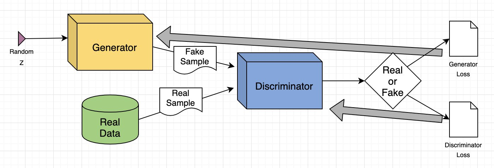
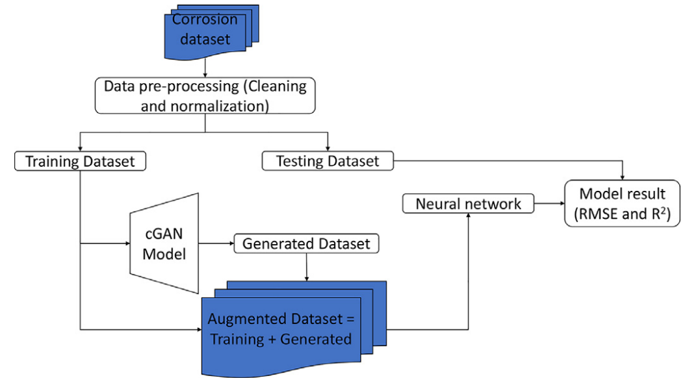
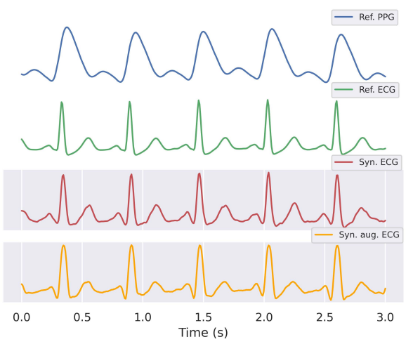
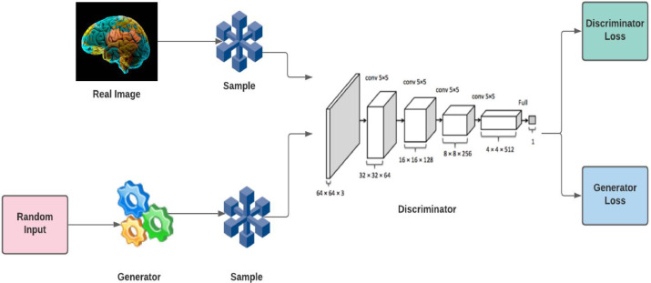

# ECG sintética con GAN/WGAN/CGAN

# **1. Generación de señales ECG sintéticas con GANs**

La generación de señales ECG sintéticas mediante Redes Generativas Antagónicas (GAN), Wasserstein GAN (WGAN) y Conditional GAN (CGAN) se ha convertido en una herramienta clave para mejorar los sistemas de diagnóstico médico, especialmente en el ámbito cardiovascular. Las redes generativas permiten la creación de señales de ECG artificiales que son útiles para entrenar modelos de aprendizaje automático, aumentar la diversidad de los datos y preservar la privacidad de los pacientes.

  

## **1.1. GAN (Generative Adversarial Network)**
Una GAN consiste en dos redes neuronales: un generador y un discriminador. El generador crea datos sintéticos (en este caso, señales ECG) a partir de una entrada aleatoria, mientras que el discriminador evalúa si las señales generadas son reales o falsas. Ambas redes compiten entre sí para mejorar la calidad de las señales generadas.

### Funcionamiento:
El generador toma un vector de ruido aleatorio y lo transforma en una señal ECG sintética. El discriminador evalúa si la señal generada se asemeja a una señal ECG real. El entrenamiento de ambas redes en conjunto mejora gradualmente la capacidad del generador para crear señales cada vez más realistas.

### Aplicaciones:
- **Aumento de datos**: Generación de señales ECG sintéticas para aumentar el número de muestras en datasets limitados.
- **Simulación de patologías**: Generación de señales para entrenar modelos de diagnóstico en condiciones cardíacas raras.
- **Entrenamiento de modelos de diagnóstico**: Mejora de la precisión de los modelos de aprendizaje automático que diagnostican enfermedades cardíacas, como arritmias.

## **1.2. WGAN (Wasserstein GAN)**
El WGAN es una mejora de la GAN clásica que utiliza la distancia de Wasserstein como función de pérdida para mejorar la estabilidad del entrenamiento. Esta métrica permite que el generador produzca señales más diversas y realistas, superando problemas comunes como el colapso de modo, en el que el generador produce un número limitado de variaciones.

### Funcionamiento:
En lugar de la pérdida tradicional basada en la probabilidad, el WGAN usa la distancia de Wasserstein, que mide cuán diferente es la distribución de los datos generados de la distribución de los datos reales. Esto permite un entrenamiento más estable y produce señales ECG más realistas.

### Aplicaciones:
- **Generación de señales realistas**: Creación de señales ECG que imitan con alta fidelidad las características de señales reales.
- **Mejora de modelos de clasificación**: Mejora de la precisión en modelos que clasifican arritmias y otras enfermedades cardíacas.
- **Estabilidad en el entrenamiento**: Utilización de WGAN para entrenar modelos generativos con mayor estabilidad y calidad en las señales.

## **1.3. CGAN (Conditional GAN)**
CGAN (Conditional Generative Adversarial Network) es una variante de GAN en la que tanto el generador como el discriminador reciben una condición adicional \(c\). Esta condición puede ser una etiqueta, un tipo de señal (normal o patológica), o incluso una señal ruidosa, lo que permite al generador producir señales ECG específicas para diferentes tipos de patologías, como arritmias o fibrilación auricular.

### Funcionamiento:
El generador en CGAN toma un vector de ruido aleatorio y una condición \(c\) (por ejemplo, una etiqueta de enfermedad) y genera una señal ECG condicionada a esa clase. El discriminador evalúa si la señal generada corresponde a una señal real de ECG de la clase \(c\). El proceso de entrenamiento consiste en mejorar ambas redes para que el generador produzca señales de ECG más precisas y el discriminador aprenda a evaluar correctamente las señales.

### Aplicaciones:
- **Data augmentation**: Generación de latidos sintéticos realistas para aumentar bases de datos de ECG.
- **Eliminación de ruido**: Remoción de artefactos musculares, interferencias y reconstrucción de ondas P, QRS y T dañadas.
- **Reconstrucción de derivaciones**: Generación de derivaciones ECG faltantes para completar registros.
- **Traducción de señal a señal**: Conversión de un tipo de latido en otro (por ejemplo, de un latido normal a uno con arritmia).
- **Generación de largas señales ECG**: Simulación de registros ECG de larga duración (minutos/horas) para entrenar modelos de diagnóstico.

# **2. Papers relevantes que han utilizado este tópico**

## **2.1. Data augmentation using conditional generative adversarial network (cGAN): Application for prediction of corrosion pit depth and testing using neural network [1]**
El artículo aborda el problema del desbalance de datos en la predicción de corrosión de tuberías utilizando un modelo cGAN (Conditional Generative Adversarial Network). El dataset original contenía mediciones de corrosión de 250 tuberías enterradas en diferentes suelos, pero la mayoría de las muestras provenían de suelos arcillosos, con pocas muestras de suelos minoritarios. Esto dificultaba que los modelos de machine learning aprendieran patrones adecuados para los suelos con menos datos.

  

Se aplicaron tres técnicas de aumento de datos:
- Random Oversampling: Duplica las muestras de las clases minoritarias, pero no crea nueva información.
- Borderline-SMOTE: Genera datos sintéticos de las clases minoritarias, pero con menor realismo.
- cGAN: Genera datos sintéticos condicionados por el tipo de suelo, produciendo distribuciones similares a las reales, incluso con pocas muestras originales.

Se construyó una red neuronal artificial (ANN) para predecir la profundidad máxima de corrosión (pit depth) usando el conjunto original y los conjuntos aumentados.

### Resultados:

- Precisión: El uso de cGAN aumentó la precisión del modelo del 81% al 90%, la mejora más alta del estudio.
- Estabilidad: El modelo con cGAN mostró valores muy cercanos entre entrenamiento y prueba (96% vs 90%), lo que indica un modelo estable y generalizable.
- Comparación: El cGAN evitó el sobreajuste que ocurrió con Random Oversampling y SMOTE (99% en entrenamiento vs 80% en prueba).

### Conclusión:
El cGAN es una técnica superior frente a métodos tradicionales de aumento de datos, como oversampling, para enfrentar el desbalance de clases en problemas de ingeniería. Su capacidad para generar datos sintéticos realistas permitió mejorar significativamente la precisión del modelo de predicción, especialmente en áreas con pocos datos reales, lo que tiene un impacto directo en la gestión de integridad de tuberías y la predicción de fallas en zonas con datos limitados.

## **2.2. P2E-WGAN: ECG Waveform Synthesis from PPG with Conditional Wasserstein Generative Adversarial Networks [2]**
El artículo propone P2E-WGAN, un modelo de aprendizaje profundo que utiliza una Wasserstein GAN condicional (cWGAN) para sintetizar señales de ECG a partir de PPG. La motivación detrás de este enfoque es utilizar la alta correlación entre ambas señales para generar ECG realistas a partir de PPG, lo que permite un monitoreo cardíaco accesible y económico usando dispositivos portátiles.

  

P2E-WGAN usa una arquitectura U-Net para el generador, que toma un segmento de PPG y genera una señal de ECG correspondiente. El discriminador PatchGAN evalúa la validez de la señal generada. El modelo optimiza tres funciones de pérdida: Wasserstein, L2 y una pérdida adicional de características para preservar los picos y valles característicos del ECG.

### Resultados:

Entrenado con la base de datos MIMIC II, el modelo logró resultados sólidos, superando otros enfoques como DCT-CNN. Las métricas principales fueron un RMSE de 0.162, una distancia de Fréchet de 0.375 y una correlación de Pearson de 0.835.

### Conclusión:

P2E-WGAN demuestra ser una herramienta eficaz para sintetizar ECG a partir de PPG, lo que facilita el diagnóstico remoto y la detección temprana de enfermedades cardíacas, mejorando el acceso y reduciendo costos en el monitoreo médico.

## **2.3. Generative adversarial network: An overview of theory and applications [3]**
El artículo presenta una revisión sistemática sobre las Redes Generativas Antagónicas (GAN), un enfoque de aprendizaje profundo que utiliza dos redes neuronales: el generador, que crea datos sintéticos, y el discriminador, que evalúa si los datos son reales o falsos. Este modelo ha revolucionado diversos campos debido a su capacidad para generar datos de alta calidad que imitan distribuciones reales.

  

Las GANs operan a través de la confrontación de dos redes:
- Generador: Produce datos sintéticos (por ejemplo, imágenes, señales).
- Discriminador: Evalúa la autenticidad de los datos, distinguiendo entre datos reales y generados.

El sistema busca converger cuando el generador es capaz de crear datos lo suficientemente realistas para engañar al discriminador.

### Resultados:
La revisión identifica una amplia variedad de aplicaciones para las GANs en diversas áreas, incluyendo:

Generación de objetos 3D, medicina (segmentación de tumores, detección de Alzheimer), pandemias (detección de COVID-19), y procesamiento de imágenes (mejora de resolución, eliminación de ruido).

Detección facial, transferencia de texturas y control de tráfico también se destacan como áreas clave de aplicación.

### Conclusión:
Las GANs han demostrado un gran potencial en la generación de datos sintéticos, con aplicaciones que abarcan desde la medicina hasta la seguridad. Sin embargo, aún enfrentan desafíos como la generación de deepfakes y el colapso de modo, los cuales deben ser abordados en futuras investigaciones para expandir aún más su utilidad y fiabilidad.

# **3. Repositorio en GitHub**

## **Codebase for "P2E-WGAN: ECG Waveform Synthesis from PPG with Conditional Wasserstein Generative Adversarial Networks [3]"**
**Paper:** P2E-WGAN: ECG waveform synthesis from PPG with conditional wasserstein generative adversarial networks [2]

El repositorio P2E-WGAN contiene el código para generar señales ECG sintéticas a partir de PPG utilizando Conditional Wasserstein GAN (cWGAN). Este modelo tiene como objetivo convertir señales de PPG, que son fácilmente medibles con dispositivos portátiles, en señales ECG realistas. Esto es especialmente útil para mejorar el monitoreo cardiovascular en dispositivos que no disponen de electrocardiogramas (ECG) pero pueden medir PPG.

El repositorio incluye el código para entrenar el modelo con datasets de PPG y ECG, permitiendo la generación de ECG sintéticos que son útiles para data augmentation. Además, se proporcionan herramientas para evaluar la calidad de las señales generadas utilizando métricas como la distancia de Wasserstein, asegurando que las señales ECG sintéticas sean de alta calidad y se asemejen a las señales reales.

### **Aplicaciones de este Repositorio**

- Aumento de datos (Data Augmentation): Genera señales ECG sintéticas para complementar datasets pequeños o desequilibrados, especialmente útil cuando los datos de ECG son limitados.

- Mejora en el diagnóstico médico: Permite entrenar modelos de diagnóstico para detectar enfermedades cardíacas usando señales ECG generadas a partir de PPG, lo que facilita la detección de arritmias y otras condiciones.

- Monitoreo remoto y dispositivos portátiles: Facilita el uso de dispositivos portátiles que miden PPG, permitiendo generar señales ECG a partir de los datos PPG, mejorando el diagnóstico y monitoreo de la salud cardiovascular.

- Investigación en generación de señales biomédicas: Abre la puerta a la generación de otras señales fisiológicas a partir de datos más accesibles, como EEG o EMG, utilizando enfoques similares de redes generativas.

- Este repositorio proporciona una herramienta eficiente para transformar datos de PPG en ECG realistas, mejorando el análisis y diagnóstico médico sin la necesidad de grandes cantidades de datos clínicos.

# **4. Referencias**
- [1] H. Woldesellasse and S. Tesfamariam, "Data augmentation using conditional generative adversarial network (cGAN): Application for prediction of corrosion pit depth and testing using neural network," Journal of Pipeline Science and Engineering, vol. 3, no. 1, p. 100091, 2023. https://doi.org/10.1016/j.jpse.2022.100091
  
- [2] K. Vo, E. K. Naeini, A. Naderi, D. Jilani, A. M. Rahmani, N. Dutt, and H. Cao, "P2E-WGAN: ECG waveform synthesis from PPG with conditional wasserstein generative adversarial networks," in *Proceedings of the 36th Annual ACM Symposium on Applied Computing*, 2021, pp. 1030-1036. https://doi.org/10.1145/3412841.3441979
  
- [3] A. Aggarwala, M. Mittalb, and G. Battinenic, "Generative adversarial network: an overview of theory and applications," Int. J. Inf. Manag. Data Insights, vol. 1, p. 100004, 2021. https://doi.org/10.1016/j.jjimei.2020.100004

- [4] K. Vo, E. K. Naeini, A. Naderi, D. Jilani, A. M. Rahmani, N. Dutt, and H. Cao, "P2E-WGAN: ECG waveform synthesis from PPG with conditional wasserstein generative adversarial networks," *GitHub*, 2021. [Online]. Available: https://github.com/xyz/P2E-WGAN

