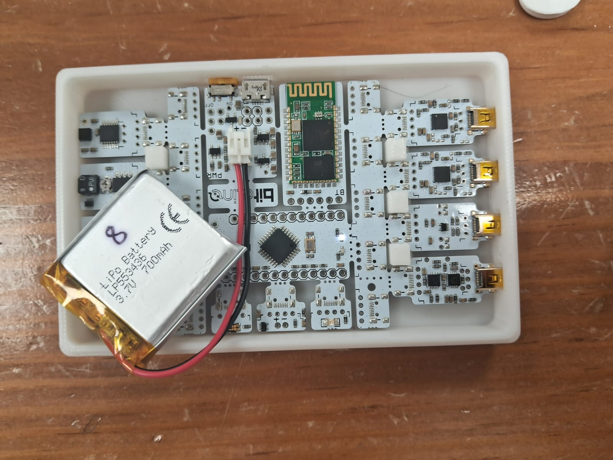
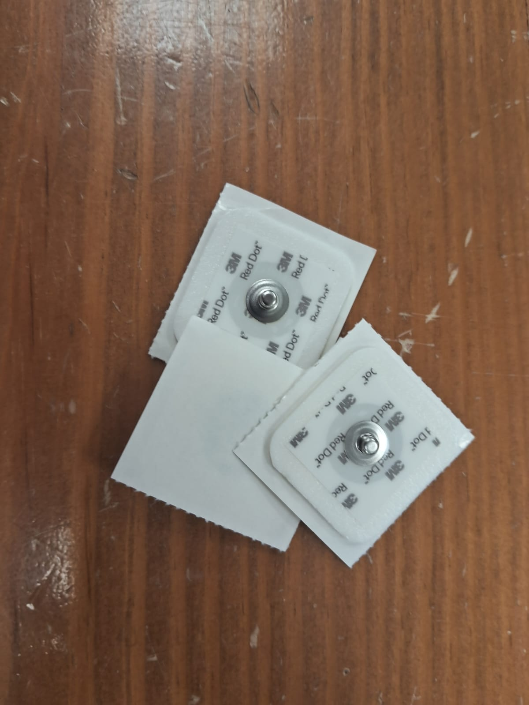
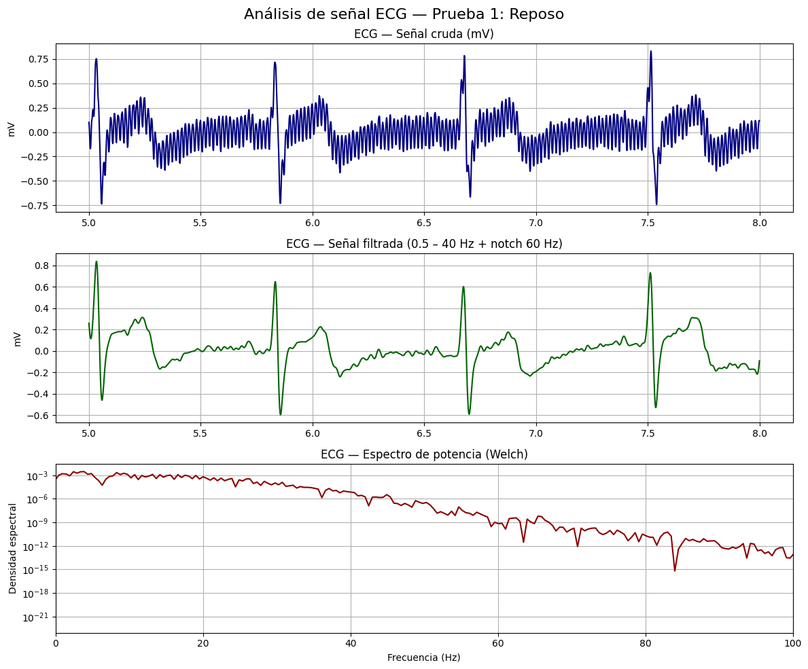
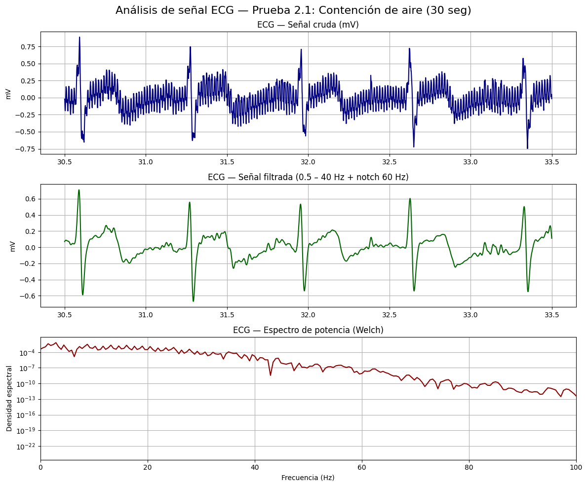
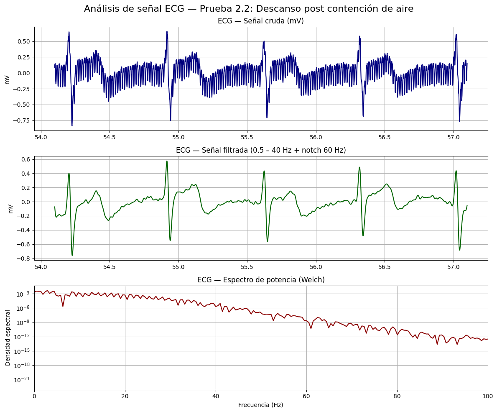
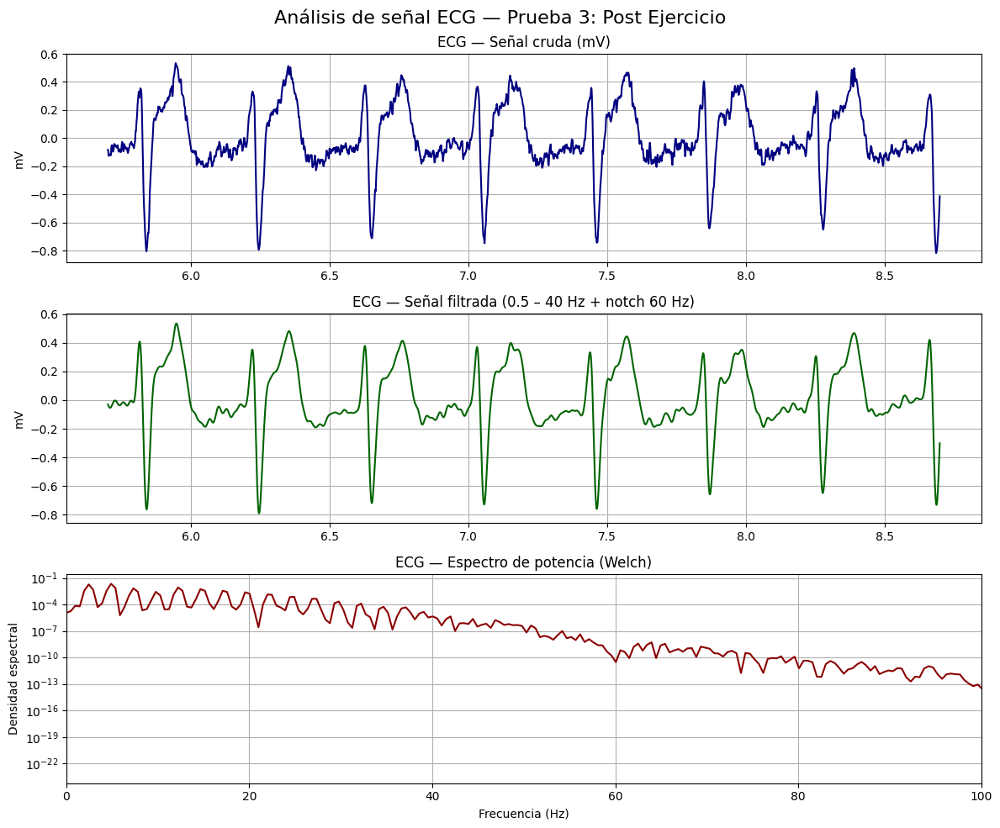

# **Reporte de laboratorio 4 - Señales ECG**

# **1. Introducción**
La electrocardiografía es un procedimiento no invasivo y sencillo que permite obtener un electrocardiograma, que puede ser analizado para evaluar indicios y síntomas de enfermedades cardíacas.
El principio de funcionamiento de un electrocardiógrafo es la detección de las señales eléctricas producidas por el sistema de conducción sel corazón. 
Cada señal de un electrocardiograma es producida por la diferencia de potencial entre dos electrodos, y son denominadas derivaciones.
Las derivaciones están estandarizadas para aportar información relevante.
Así, cada derivación o conjunto de derivaciones es más apropiada para visualizar un determinado aspecto del sistema de conducción eléctrica del corazón, como la conducción de una determinada zona en una determinada dirección.

Esto permite integrar varios aspectos de la conducción del potencial de acción del corazón como:
- La transmisión del potencial de acción en las aurículas (derecha/izquierda).
- La transmisión del potencial de acción por el haz de his.
- La transmisión del potencial de acción por los ventrículos (derecho/izquierdo).
O incluso regiones más pequeñas.
En este caso, se usarán 3 electrodos, que permitirán visualizar las derivaciones I, II, y III.

Dependiendo de la derivación y la cantidad de ruido, se podrá observar:

En esta actividad visualizaremos el ECG en reposo, con aguante de respiración, y finalmente tras actividad física prolongada.
Podremos esperar lo siguiente (hipótesis):
- Ritmo cardíaco constante en reposo.
- Ritmo cardíaco constante al comienzo y con un aumento del ritmo cerca del final, con aguante de la respiración.
- Ritmo cardíaco elevado y gradualmente decreciente, tras actividad física.

[Detalles de la actividad]

# **2. Objetivos**

- Adquisición de señales de ECG, utilizando el kit BiTalino: Evaluación en 3 momentos: reposo, respiración controlada y post actividad aeróbica.
- Compresión del uso de softwares para la visualización de los resultados de los biopotenciales y realización de analisis de señales obtenidas.

# **3. Materiales**

|  |  |  |  |
|----------|----------|----------|----------|
| **Un kit BITalino** | **Conector bipolar para electrodos** | **3 electrodos** | **Laptop con software Open Signals** |

# **4. Procedimiento**
Para la medición de las señales ECG en el laboratorio se realizarán tres lecturas. 
Los momentos a evaluar en el sujeto son los siguientes:
- **En reposo**
- **Contención de aire durante 30 segundos + descanso de 1 minuto (3 veces)**
- **Evaluación post actividad aeróbica (1 vez)**

## **Conexión de electrodos**

  
  Para esta práctica, posicionamos los electrodos la forma en como se ve en la imagen; el electrodo del canal negativo va conectado en la muñeca derecha, el electrodo del canal positivo conectado en la muñeca izquierda, mientras que el electrodo de referencia va posicionado a la altura de la cresta iliaca.

La razón por la que se escogió está conexión en las muñecas ya que permiten captar la diferencia de potencial generada por la actividad eléctrica cardíaca, sabiendo que los brazos son puntos distales y alejados del corazón, permite registrar una señal que representa la suma de vectores eléctricos generados durante cada latido [1], y de la misma forma se confirma como recomiende la guia del American Heart Association [2].

## **4.1. Prueba 1: Reposo**

## **4.2. Prueba 2: Contención de aire (30 seg) y descanso (1 min)**
## **4.2.1 Contención de aire**

## **4.2.2 Descanso post contención de aire**

## **4.3. Prueba 3: Post Actividad física aeróbica**

#### *Nota: los videos referentes a cada uno de los procedimientos se encuentran en la carpeta Videos*

# **5. Resultados**
 
 En el procesamiento de señales ECG, es común aplicar un filtro pasa-banda previo al análisis para mejorar la calidad de la señal y facilitar la detección de las ondas características. Esto se debe a que la actividad eléctrica del corazón se concentra principalmente en un rango de frecuencias bien definido, mientras que otros componentes fuera de este rango suelen corresponder a ruido o artefactos.
 
 De acuerdo con Zyout et al., antes del análisis el ECG “is typically band-pass filtered using several frequency ranges. The frequency range used is 0.5 – 40 Hz” [3]. Este rango permite eliminar el ruido de baja frecuencia asociado a movimientos respiratorios o a la deriva de la línea base (< 0.5 Hz), al mismo tiempo que atenúa componentes de alta frecuencia (> 40 Hz) causados por la actividad muscular o interferencias eléctricas, conservando únicamente la información clínica relevante (ondas P, complejo QRS y onda T). 

## **5.1. Prueba 1: Reposo**

## **5.2. Prueba 2: Contención de aire (30 seg) y descanso (1 min)**
## **5.2.1 Contención de aire**

## **5.2.2 Descanso post contención de aire**

## **5.3. Prueba 3: Post Actividad física aeróbica**

## **5.4 Interpretación de resultados**

# **6. Referencias**
- [1] *Farrell, R. M., Syed, A., Syed, A., & Gutterman, D. D. (2008). Effects of limb electrode placement on the 12- and 16-lead electrocardiogram. Journal of Electrocardiology, 41(6), 536–545.* 
- [2] *Kligfield, P., Gettes, L. S., Bailey, J. J., Childers, R., Deal, B. J., Hancock, E. W., van Herpen, G., Kors, J. A., Macfarlane, P., Mirvis, D. M., Pahlm, O., Rautaharju, P., & Wagner, G. S. (2007). Recommendations for the Standardization and Interpretation of the Electrocardiogram. Circulation, 115(10), 1306–1324.*
- [3] *Zyout, A. A., Alquran, H., Mustafa, W. A., & Alqudah, A. M. (2023). Advanced time-frequency methods for ecg waves recognition. Diagnostics, 13(2), 308.*
