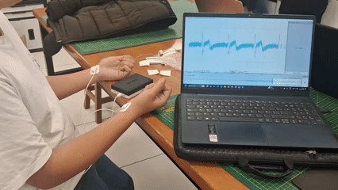
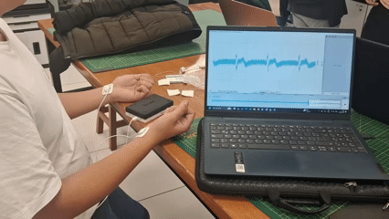

# **Reporte de laboratorio 4 - Señales ECG**

## **1. Introducción**
La electrocardiografía es un procedimiento no invasivo y sencillo que permite obtener un electrocardiograma, que puede ser analizado para evaluar indicios y síntomas de enfermedades cardíacas.
El principio de funcionamiento de un electrocardiógrafo es la detección de las señales eléctricas producidas por el sistema de conducción sel corazón. 
Cada señal de un electrocardiograma es producida por la diferencia de potencial entre dos electrodos, y son denominadas derivaciones.
Las derivaciones están estandarizadas para aportar información relevante.
Así, cada derivación o conjunto de derivaciones es más apropiada para visualizar un determinado aspecto del sistema de conducción eléctrica del corazón, como la conducción de una determinada zona en una determinada dirección.

Esto permite integrar varios aspectos de la conducción del potencial de acción del corazón como:
- La transmisión del potencial de acción en las aurículas (derecha/izquierda).
- La transmisión del potencial de acción por el haz de his.
- La transmisión del potencial de acción por los ventrículos (derecho/izquierdo).
O incluso regiones más pequeñas.
En este caso, se usarán 3 electrodos, que permitirán visualizar las derivaciones I, II, y III.

Dependiendo de la derivación y la cantidad de ruido, se podrá observar:

  

En esta actividad visualizaremos el ECG en reposo, con aguante de respiración, y finalmente tras actividad física prolongada.
Podremos esperar lo siguiente (hipótesis):
- Ritmo cardíaco constante en reposo.
- Ritmo cardíaco constante al comienzo y con un aumento del ritmo cerca del final, con aguante de la respiración.
- Ritmo cardíaco elevado y gradualmente decreciente, tras actividad física.

[Detalles de la actividad]

## **2. Objetivos**

- Adquisición de señales de ECG, utilizando el kit BiTalino: Evaluación en 3 momentos: reposo, respiración controlada y post actividad aeróbica.
- Compresión del uso de softwares para la visualización de los resultados de los biopotenciales y realización de analisis de señales obtenidas.

## **3. Materiales**

|  |  |  |  |
|----------|----------|----------|----------|
| **Un kit BITalino** | **Conector bipolar para electrodos** | **3 electrodos** | **Laptop con software Open Signals** |

## **4. Procedimiento**
Para la medición de las señales ECG en el laboratorio se realizarán tres lecturas. 
Los momentos a evaluar en el sujeto son los siguientes:
- **En reposo**
- **Contención de aire durante 30 segundos + descanso de 1 minuto (3 veces)**
- **Evaluación post actividad aeróbica (1 vez)**

### **4.1 Conexión de electrodos**
Para esta práctica, posicionamos los electrodos de esta forma: el electrodo del canal negativo va conectado en la muñeca derecha, el electrodo del canal positivo conectado en la muñeca izquierda, mientras que el electrodo de referencia va posicionado a la altura de la cresta iliaca; estas indicaciones se muestran en la imagen.

  

La razón por la que se escogió está conexión en las muñecas ya que permiten captar la diferencia de potencial generada por la actividad eléctrica cardíaca, sabiendo que los brazos son puntos distales y alejados del corazón, permite registrar una señal que representa la suma de vectores eléctricos generados durante cada latido [1], y de la misma forma se confirma como recomiende la guia del American Heart Association [2].

### **4.2 Pruebas**

<table>
    <thead>
        <tr>
            <th>Prueba 1: Reposo</th>
            <th colspan=2 align="center">Prueba 2: Contención de aire (30 seg) y descanso (1 min)</th>
        </tr>
    </thead>
    <tbody>
      <tr>
        <td align="center">Reposo</td>
        <td align="center">Contención de aire</td>
        <td align="center">Descanso post contención de aire</td>
      </tr>
      <tr>
        <td align="center"></td>
        <td align="center"></td>
        <td align="center"></td>
      </tr>
    </tbody>
</table>

<table>
    <thead>
        <tr>
            <th colspan=2 align="center">Prueba 3: Post Actividad física aeróbica</th>
        </tr>
    </thead>
    <tbody>
      <tr>
        <td align="center">Actividad física</td>
        <td align="center">Descanso</td>
      </tr>
      <tr>
        <td align="center"></td>
        <td align="center"></td>
      </tr>
    </tbody>
</table>

## **5. Resultados**
 
 En el procesamiento de señales ECG, es común aplicar un filtro pasa-banda previo al análisis para mejorar la calidad de la señal y facilitar la detección de las ondas características. Esto se debe a que la actividad eléctrica del corazón se concentra principalmente en un rango de frecuencias bien definido, mientras que otros componentes fuera de este rango suelen corresponder a ruido o artefactos.
 
 De acuerdo con Zyout et al., antes del análisis el ECG “is typically band-pass filtered using several frequency ranges. The frequency range used is 0.5 – 40 Hz” [3]. Este rango permite eliminar el ruido de baja frecuencia asociado a movimientos respiratorios o a la deriva de la línea base (< 0.5 Hz), al mismo tiempo que atenúa componentes de alta frecuencia (> 40 Hz) causados por la actividad muscular o interferencias eléctricas, conservando únicamente la información clínica relevante (ondas P, complejo QRS y onda T). 

### **5.1. Prueba 1: Reposo**

### **5.2. Prueba 2: Contención de aire (30 seg) y descanso (1 min)**
#### **5.2.1 Contención de aire**

#### **5.2.2 Descanso post contención de aire**

### **5.3. Prueba 3: Post Actividad física aeróbica**

### **5.4 Interpretación de resultados**
Para la interpretación de los resultados de estas 4 gráficas se realizó una busqueda de bibliografía relevante que demuestre las principales características de los resultados encontrados, logrando de esta manera, hallar una sustentación científica a la respuesta de las señales del ECG que logramos graficar en el apartado anterior. Para este analisis e interpretación se consultó con 3 papers enfocados a la toma de señales ECG antes, durante y después de esfuerzo físico, enfocandonos en tanto los resultados que se hallaron en los 3 momentos como en los diferentes cambios encontrados entre cada etapa, de esta manera, se logró encontrar características y elementos claves para la comparación entre nuestras señales con las brindadas en los papers. Los estudios en lo que nos hemos basado este analisis fueron: *Novel Signal Processing Method for Exercise ECG*, *Gradual Changes of ECG Waveform During and After Exercise in Normal Subjects* y *ECG Authentication in Post-Exercise Situation*.

**Prueba 1 - Gráficas de Réposo:**
Se puede apreciar un ritmo regular, tanto las ondas P, QRS y T se encuentran bien definidas y lo importante es que se logra observar una frecuencia cardíaca estable. La gráfica de espectro de potencia muestra una mayor energía durante frecuencias bajas, la cual es una característica muy común de ECG que se encuentra en estado de reposo. Contrastando con la literatura, de acuerdo con *Sung et al.* (2017) la condición de reposo es la más estable para la realización de un análisis biométrico, ya que la morfología del ECG se mantiene constante, no demuestra perturbaciones relevantes que generen ruido en la señal [4]. Por otro lado, *Simoons & Hugenholtz* (1975) menciona que el estado de reposo es normalmente tomado como linea basal para la comparación de los cambios inducidos en la señal a causa del ejercicio [5].

**Prueba 2.1 - Gráfica de Contención de aire:**
En esta gráfica se puede apreciar un aumento de la amplitud en QRS, además de una ligera variabilidad en el intervalo RR, la cual es muy probable que refleje una bradicardía inicial seguida de una compensación. Las bajas frecuencias siguen siendo predominantes en la gráfica de espectro de potencia, aunque se puede observar mayor cantidad de irregularidades. Siguiendo con lo mencionado en el estudio de *Simoons & Hugenholtz*, podemos notar como es que tanto la onda P y la T presentan cambios transitorios, esto es debido a la presencia de una carga fisiológica, la cual a pesar de no ser la misma que en el estudio (ejercicio dinámico vs estrés respiratorio) influye en los datos medidos por el ECG [5].

**Prueba 2.2 - Gráfica de Descanso post-contención:**
Se puede apreciar como el ritmo cardiaco se va estabilizando, la frecuencia retorna a valores cercanos al reposo, se aprecia ondas más regulares y una notable reducción de la variabilidad. Este comportamiento coincide con la fase de recuperación temprana, en donde, tanto las ondas P y T presentan cambios graduales antes de su normalización. Esto da paso a la inferencia que las señales ECG tienden a ser más variables inmediatamente después de la exposición a un esfuerzo breve, recobrando la fase de estabilidad en poco tiempo [4] [5].

**Prueba 3 - Post Ejercicio Aeróbico:**
En la prueba 3 se puede apreciar cierto grado de taquicardia (presencia de ritmo acelerado), además de intervalos RR más cortos, con las ondas P y T más cerca a las QRS. El espectro de potencia cambió de ser mayoritariamente rangos bajos a ser rangos medios (10-30 Hz), demostrando de esta manera una mayor actividad eléctrica en el cuerpo y el constante movimiento de los electrodos. Como las mediciones se realizaron justo después de una actividad física (correr en este caso) y los electrodos estuvieron pegados al sujeto de prueba, es probable que el constante movimiento haya influido en la forma tan irregular de la gráfica de espectro. En sí las gráficas que lograron sacar de la prueba 3 recrear de manera correcta el comportamiento post-ejercicio inmediato encontrado en la bibliografía, donde las ondas P y T se acercan a las ondas QRS debido a la alta frecuencia influyendo en la estabilidad morfológica. Cabe recalcar que el proceso de filtrado se vuelve vital para graficar las gráficas de manera correcta, puesto que esta sujeto a mucho ruido proveniente de factores externos como el sudor, movimiento o contracciones musculares [4] [6] [7].  

En conclusión, los resultados coinciden tanto con los resultados esperados como con los datos teóricos extraidos de la bibliografía. Separando en 3 etapas de pre ejercicio (señal ideal: estable y clara), etapa durante el ejercicio (variaciones fisiológicas claras, variación de frecuencia y amplitud de ondas, así como desplazamiento de estas) y etapa post ejercicio (Taquicardía con cambios morfológicos, además de presencia de mayor cantidad de perturbaciones como sudor, contracciones musculares o movimiento el cual modula indirectamente la calidad del ECG) .

## **6. Referencias**
- [1] *Farrell, R. M., Syed, A., Syed, A., & Gutterman, D. D. (2008). Effects of limb electrode placement on the 12- and 16-lead electrocardiogram. Journal of Electrocardiology, 41(6), 536–545.* 
- [2] *Kligfield, P., Gettes, L. S., Bailey, J. J., Childers, R., Deal, B. J., Hancock, E. W., van Herpen, G., Kors, J. A., Macfarlane, P., Mirvis, D. M., Pahlm, O., Rautaharju, P., & Wagner, G. S. (2007). Recommendations for the Standardization and Interpretation of the Electrocardiogram. Circulation, 115(10), 1306–1324.*
- [3] *Zyout, A. A., Alquran, H., Mustafa, W. A., & Alqudah, A. M. (2023). Advanced time-frequency methods for ecg waves recognition. Diagnostics, 13(2), 308.*
- [4] *Sung D, Yoo H, Lee J, Lee M. ECG authentication in post-exercise situation. Conf Proc IEEE Eng Med Biol Soc. 2017;2017:4522-5*
- [5] *Simoons ML, Hugenholtz PG. Gradual changes of ECG waveform during and after exercise in normal subjects. Circulation. 1975;52(4):570-7.*
- [6] *Kaiser W, Findeis M. Novel signal processing methods for exercise ECG. Comput Cardiol. 2000;27:71-8.*
- [7] *Fauzi MF, Mustaffa F, Danis A, Rosly MM, Ramli FR, Rahim HA, et al. Muscle fatigue detection using ECG and EMG signals during exercise. IAES Int J Artif Intell. 2022;11(1):240-8.*
