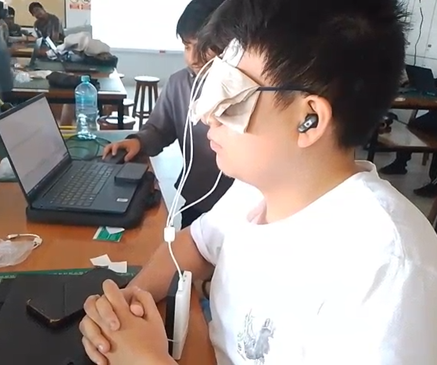

# **Reporte de laboratorio 5 - Señales EEG**

## **1. Introducción**

  Un electroencefalograma (EEG) es un estudio que mide la actividad eléctrica cerebral empleando electrodos, con el fin de apoyar al diagnóstico de trastornos neuronales.
  Usualmente para distribución de los electrodos en las mediciones, se utiliza el sistema 10-20 la cual es una metodología que distribuye los puntos de colocación de electrodos, separandolos del 10% o 20% entre cada uno con respecto a la longitud calculada (del nasion al inion).

  Las oscilaciones en el potencial eléctrico del cerebro se categorizan en diferentes bandas de frecuencias: 
  - **Bandas Delta**: Esta banda aparece en la región de los lóbulos temporal y parietal y tiene una amplitud significativa, además de tener una frecuencia característica de 0.5 Hz a 4 Hz. Representan un estado de sueño profundo, neuroisquemia, hipotermia profunda y plano profundo de anestesia.
  - **Bandas Theta**: Esta banda aparece en la adolescencia y se relaciona con las emociones y el estado mental, además de ser más evidente en adultos con emociones negativas. Esta tiene una frecuencia característica de 4 Hz a 8 Hz. Describe al individuo en estado de somnolencia, con leve depresión bioeléctrica cortical.
  - **Bandas Alfa**:  Esta banda aparece en la parte posterior del cerebro y a ambos lados, además de ser la onda con la frecuencia más alta que puede leerse en un EEG teniendo como rango frecuencias de 8 a 13 Hz. Representa que el sujeto se encuentra en un estado de calma, ojos cerrados, consciente.
  - **Bandas Beta**: Esta banda aparece en ambos hemisferios cuando la corteza cerebral está más excitada bajo un nivel de estrés alto y ronda frecuencias entre  13 Hz a 30 Hz. Demuestra que el sujeto se somete a una etapa de concentración y la actividad mental activa. 
  - **Bandas Gamma** :  Esta banda tiene las frecuencias más altas, mayores a 30 Hz, y se relacionan con procesos cognitivos complejos, como el procesamiento de información, la resolución de problemas y el aprendizaje; en otras palabras una actividad cerebral incrementada.
  

    
  

## **2. Objetivos**
- Adquisición de señales de EEG, utilizando el kit BiTalino: Evaluación en diferentes momentos donde el cerebro trabaja.
- Compresión del uso de softwares para la visualización de los resultados de los biopotenciales y realización de analisis de señales obtenidas.

## **3. Materiales**

|  |  |  |  |
|----------|----------|----------|----------|
| **Un kit BITalino** | **Conector bipolar para electrodos** | **3 electrodos** | **Laptop con software Open Signals** |

## **4. Procedimiento**
Para la medición de las señales EEG en el laboratorio se realizarán diferentes lecturas cuyos momentos a evaluar en el sujeto son los siguientes:
- **Reposo** 
- **Fijar vista en un punto específico**
- **Ejercicio cognitivo de resta**
- **Acción de masticar cada 2 segundos**
- **Actividad libre (escuchar música)**

Para un mejor desarrollo y recogo de las señales EEG, se trató en mitigar lo mejor posible los estímulos externos como la luz de dia (usando un pedazo de papel o tela que disminuya la luz entrante en los párpados) y ruido externo, tanto del ambiente de laboratorio como de afuera de este (usando audífonos con jebe que puedan suprimir el ruido).

### **4.1 Conexión de electrodos**
|  |  |
|----------|----------|
| **Posición Fp1 y Fp2 para comparar hemisferios frontales** | **Posición O2 para actividad visual** |

### **4.2 Pruebas**
<table>
    <thead>
        <tr>
            <th align="center">Reposo</th>
            <th align="center"> Fijar vista</th>
            <th align="center"> Ejercicio cognitivo</th>
        </tr>
    </thead>
    <tbody>
      <tr>
        <td rowspan=2  align="center">En este ejercicio se procuró que el sujeto de pruebas esté los más quieto posible, con una respiración calmada y aislando de los estimulos externos (luz y ruidos), todo durante 1 minuto</td>
        <td align="center">Consistió en medir la respuesta del cerebro por medio de una actividad ligera, mirar un punto en específico. En esta prueba se aisló el sonido del ambiente para mayor concentración del usuario. El ejercicio tuvo duración de 1 minuto</td>
        <td align="center">El ejercicio trató de otra actividad cognitiva pero con un nivel un poco mayor, calcular restas sucesivas mentalmente, en este caso fue partir de 100 e ir restando de 7 en 7. Aquí también se mitigaron los estimulos externos</td>
      </tr>
      <tr>
        <td align="center"></td>
        <td align="center"></td>
      </tr>
    </tbody>
</table>

<table>
    <thead>
        <tr>
            <th align="center"> Masticación cada 2 segundos</th>
            <th align="center"> Actividad libre</th>
        </tr>
    </thead>
    <tbody>
      <tr>
        <td align="center">Para esta sección se dieron a escoger entre dos movimientos: Parpadear o masticar; cada uno con un lapso de dos segundos. El tiempo total de la ejecución fue de 1 minuto</td>
        <td align="center">En esta ultima actividad, se enfocó en que el sujeto tuviera que escuchar música para medir como afecta el estimulo audivito al cerebro. Se realizó una variación en cuanto a la selección del género de la música; primero se reprodujo un pista que transmitía calma/relajación durante 15 segundos, luego por otros 30 segundos se cambio a una melodía de rock/metal para evaluar como percibe el sujeto esta transición</td>
      </tr>
    </tbody>
</table>

## **5. Resultados**

  En EEG de reposo y tareas cognitivas se busca preservar las bandas canónicas (δ, θ, α, β, γ baja) y suprimir deriva lenta y EMG de alta frecuencia; por eso se aplica un pasa-banda ≈0.5–45/48 Hz, práctica empleada y recomendada en estudios actuales de análisis EEG para tareas cognitivas y reposo. Ejemplo reciente: un protocolo de atención/distraicción usa 0.5–45 Hz antes del análisis espectral y la corrección de artefactos [1D]. Además, revisiones metodológicas modernas describen este rango y el papel del preprocesado (filtrado + limpieza) como paso estándar antes de extraer potencia por bandas [2D].
  Respecto al ruido de red (50/60 Hz), puede atenuarse con un notch solo si el pico está presente; existen alternativas (p. ej., spectrum interpolation) que evitan distorsiones que el notch puede introducir. La literatura metodológica lo discute y propone procedimientos específicos para eliminar la línea con menor sesgo [3D].
  Cuando se comparan condiciones (p. ej., ojos abiertos vs. cerrados; reposo vs. tarea), la potencia relativa —potencia de banda dividida por la potencia total (p. ej., 0.5–48 Hz)— reduce la variabilidad inter-sujeto debida a impedancias y ganancias y resalta cambios proporcionales entre estados. En tareas cognitivas se usa explícitamente para mitigar las diferencias entre sujetos y mejorar la comparabilidad [4D], y su definición formal (band/total) está estandarizada en la literatura [5D].
  Aplicada al paradigma clásico ojos abiertos vs. cerrados, la potencia α relativa disminuye con ojos abiertos y aumenta con ojos cerrados, efecto documentado en estudios recientes de reposo (EO/EC) y que justifica reportar α en forma relativa para comparaciones entre condiciones/sujetos [6D].

### **5.1. Gráficas obtenidas**
### **5.1.1 Prueba 1 - Basal 1: EEG en reposo**

### **5.1.2 Prueba 2 - Basal 2: EEG en reposo y vista punto fijo**

### **5.1.3 Prueba 3 - Tarea cognitiva: EEG restar 7 desde 100**

### **5.1.4 Prueba 4 - Artefactos: EEG arterfacto cada 2 segundos**

### **5.1.5 Prueba 5 - Libre: EEG escuchar música suave a potente**

### **5.2. Comparación potencia α en ojos abiertos vs. cerrados**

### **5.3. Comparación potencia α en ojos abiertos vs. cerrados**

### **5.4. Comparación potencia α en ojos abiertos vs. cerrados**

### **5.4 Interpretación de resultados**
Para la interpretación de los resultados de estas gráficas se procedió a realizar una investigación bibliográfica de distintos papers que permitieran demostrar la validez de los resultados que se hallaron de las gráficas del apartado anterior. Para esta validación se consulto con distintos papers acerca de las señales captadas en respuesta a estímulos de EEG. Se busco que los estudios presenten condiciones similares a las de nuestro laboratorio y de preferencia se buscó papers que presenten pruebas similares a las nuestras. De esta manera se busco realizar una comparación más precisa y directa de cada gráfica y determinar las carácteristicas únicas que presenta cada estímulo.

## Prueba 1 - Gráficas de reposo
En estas gráficas se puede apreciar, en la gráfica 1, tanto la actividad cerebral como ruido fisiológicos y eléctricos, de ahí una necesidad vital de realizar un filtrado, puesto que se complicaba la distinción de ritmos y señales. Se realizó un filtrado pasa-banda entre 0.8 al 48 Hz, eliminando las derivas lentas  y el ruido de alta frecuencia, en busca de una señal más limpia y centrada en rangos de EEG. Esto será una constante debido a las limitaciones de hardware con el que se contó por lo que el proceso de filtrado casi siempre será el mismo.
Del gráfico de potencia se puede apreciar la presencia de diferentes bandas. La banda *Delta*, la cual hace referencia a la potencias bajas, es esperable en sujetos despiertos. La banda *Theta* se encuentra discreta, efecto típico de respuesta a estados de somnoliencia o relajación. La banda *Alpha* se muestra relajada, no hay presencia de un pico claro puesto que la persona se encuentra en reposo. Esta condición da pie al ritmo alfa occipital, la cual es una onda cerebral que se registra en la corteza cerebral en la región occipital que es clara en un estado de reposo y relajación. La banda *Beta* registra una potencia más baja de lo habitual debido al estado de la persona y finalmente la banda *Gamma* presenta un pico destacable alrededor de 40 Hz, lo cual puede deberse a una actividad gamma fisiológica, procesos de atención internos o posibles ruidos msuculares.

##  Prueba 2 - Gráficas de vista fija en un punto
En el espectro de potencia, se distinguen las distintas bandas de frecuencia. La banda Delta muestra niveles bajos, como se espera en sujetos despiertos. La banda Theta aparece de forma discreta, asociada a estados de relajación ligera. La banda *Alpha* se mantiene estable, sin un pico prominente, lo cual puede explicarse por la condición experimental: aunque la persona está en reposo, la fijación visual en un punto tiende a reducir la potencia alfa respecto a la condición de ojos cerrados. La banda *Beta* se encuentra más activa en comparación con la prueba anterior, lo que es coherente con un estado de atención sostenida inducido por la tarea de fijación visual. Finalmente, en la banda *Gamma* se observa un pico notorio alrededor de 40 Hz, que podría asociarse a actividad cortical rápida vinculada a la concentración en el estímulo visual, aunque no se descarta que parte de esta potencia provenga de actividad muscular residual. Las gráficas reflejan el patrón consistente con estado de reposo vigilante, donde la fijación en un punto visual y el aislamiento auditivo producen que el ritmo *Alpha* se atenue y la actividad de la onda *Beta* y *Gamma* aumente

## Prueba 3 - Gráficas de ejercicio cognitivo de resta
En la gráficas se pueden distinguir las diferentes bandas de frecuencia. La banda *Delta* se mantiene en niveles bajos, como es esperable en sujetos despiertos. La banda *Theta* aparece algo más marcada respecto a condiciones de reposo pasivo, lo que puede relacionarse con la carga cognitiva moderada asociada a la tarea aritmética. La banda *Alpha* muestra una disminución evidente en su potencia, sin un pico claro, lo cual es consistente con la supresión del ritmo alfa ante tareas que requieren concentración mental. La banda Beta presenta un aumento respecto a pruebas basales, reflejando un mayor compromiso atencional y de procesamiento cognitivo. Finalmente, en la banda *Gamma* se observa un pico alrededor de 40 Hz, que puede estar asociado a procesos corticales rápidos vinculados al esfuerzo de cálculo y mantenimiento de la tarea, aunque siempre debe considerarse la posible contribución de actividad muscular residual. Las gráficas logran evidenciar el patrón caracteristico de una condición de actividad cognitiva sostenida en donde la reducción del ritmo Alpha y el incremento de ondas *Gamma* y *Beta* reflejan un estado de concentración requerido para realizar la tarea mental de manera sostenida.

## Prueba 4 - Gráficas de masticación cada 2 segundos
En las gráficas se pueden apreciar la presencia de artefactos recurrentes cada 2 segundos introduce distorsiones que afectan la claridad del registro. La banda Delta se observa con valores más elevados de lo esperado, lo cual puede estar influenciado por dichos artefactos de baja frecuencia. La banda Theta aparece discreta, sin cambios notables asociados a estados cognitivos, dado que la señal se ve dominada por interferencias externas. La banda Alpha no presenta un pico prominente, lo cual es coherente con la alteración de la señal causada por el ruido periódico. La banda Beta se mantiene estable, aunque su interpretación resulta limitada debido a la superposición de los artefactos. Finalmente, en la banda Gamma se observa nuevamente un pico cercano a los 40 Hz, pero en este caso debe analizarse con precaución, ya que podría estar potenciado por la actividad muscular o el efecto repetitivo de los artefactos. Estas gráficas evidencian como la introducción de artefactos controlados cada 2 segundos degrada la calidad del EEG, puesto que incrementa artificialmente la potencia de bandas bajas y dificulta la interpretación confiable de ritmos como Alpha y Beta, reflejando la importancia de un preprocesamiento y eliminación adecuada de artefactos para poder extraer conclusiones válidas del registro electroencefalográfico.

## Prueba 5 - Graficas de escuchar música
En el gráfico se logra distinguir las principales bandas EEG bajo la condición de escucha de música libre. Durante los primeros segundos sin estímulo musical, la actividad se mantiene similar al reposo, con baja potencia en Delta y Theta y una banda Alpha discreta, sin un pico marcado. Tras la introducción del ruido azul, se observa una atenuación adicional de la actividad Alpha y un ligero incremento en la banda Beta, lo cual puede asociarse a un estado de activación sensorial sostenida. Finalmente, con la exposición al tema BYOB (System of a Down), caracterizado por alta intensidad rítmica y variabilidad sonora, se aprecia un aumento más evidente en la potencia Beta y un refuerzo notable en la banda Gamma alrededor de 40 Hz, reflejando una mayor exigencia de procesamiento auditivo y atencional. Las gráficas muestran cómo la transición de un estado basal a uno con estimulación auditiva intensa modula el EEG: la supresión de Alpha junto con el aumento en Beta y Gamma son consistentes con procesos de arousal cortical, atención y procesamiento multimodal, característicos de la respuesta cerebral a música de alta energía y complejidad rítmica.

## Gráficas de potencia α en ojos abiertos vs. cerrados
El análisis comparativo de las señales EEG evidencia patrones consistentes con la literatura. En la banda alfa (8–13 Hz) se observa un incremento de potencia con los ojos cerrados, reflejando la aparición del ritmo occipital alfa como marcador de relajación y desconexión visual, mientras que con los ojos abiertos la potencia disminuye debido al mayor procesamiento visual y atencional. En contraste, la banda beta (13–30 Hz) muestra menor potencia en reposo y un aumento significativo durante la ejecución de tareas cognitivas (del 31.6 % en reposo a 40.4 % en tarea), lo cual denota un mayor compromiso atencional, procesamiento cognitivo y actividad motora. Asimismo, la detección de artefactos revela episodios donde la señal supera el umbral de ±70 µV, confirmando mediante la envolvente que corresponden a interferencias musculares o de movimiento más que a actividad cerebral genuina. Este control de calidad resulta esencial, ya que garantiza que las diferencias observadas entre condiciones se atribuyan realmente a la modulación de la actividad cerebral, y no al ruido, validando así la interpretación de los registros.

## **6. Preguntas adicionales**
### ¿Qué banda de frecuencia predomina al cerrar los ojos?
Si bien no es tan fácil de distinguir debido al ruido y alteraciones, las ondas alfa son las que aumentan al cerrar los ojos(si bien en total las ondas beta suman una mayor potencia), asociadas a un estado de lucidez con relajación causada por la disminución de los estímulos externos.

### ¿Qué filtro es imprescindible para EEG y por qué?
Se tiene que utilizar un filtro pasa banda que permita incluir desde 0.5 Hz hasta alrededor de 40 o 50 Hz, y si se desea detectar las ondas de mayor frecuencia, es útil usar filtros Notch para eliminar los ruidos por dispositivos y de red que se presentan en estas frecuencias más altas. Como el filtrado constituye un paso imprescindible en el procesamiento de EEG, dado que las señales son muy débiles y fácilmente contaminadas por ruido fisiológico (parpadeos, EMG), ambiental y eléctrico. El uso de filtros FIR de fase lineal es recomendado por su estabilidad y por evitar la distorsión de fase, mientras que la aplicación de un filtro pasabanda resulta esencial para eliminar tanto interferencias de baja frecuencia (derivas, respiración, sudoración, masticación) como de alta frecuencia (artefactos musculares, ruido eléctrico o mecánico). Además, estudios recientes han demostrado que los filtros band-stop con ventana Bartlett ofrecen un rendimiento óptimo en bandas específicas como alfa, delta y gamma, gracias a su baja latencia y alta selectividad, permitiendo conservar la integridad de la señal cerebral y mejorar la extracción de características para el análisis posterior.

### ¿Puedes modular conscientemente tu señal EEG? Da un ejemplo.
Sí es posible modular la señal de EEG, por ejemplo mediante la meditación, en la que aumenta significativamente la prevalencia de las ondas alfa.

### ¿Se observan diferencias entre Fp1 y Fp2? ¿Por qué podrían ocurrir?
Sí se observarían diferencias entre fp1 y fp2, que probablemente ocurren debido al diferente nivel de actividad en cada uno de los lóbulos y su cercanía distinta a cada electrodo.

## **7. Referencias**
[1D] P. Kaushik et al., “Decoding the cognitive states of attention and distraction in a sustained-attention task using EEG,” Sci. Rep., 2022 — usa band-pass 0.5–45 Hz en el preprocesado. 

[2D] A. Chaddad et al., “Electroencephalography Signal Processing,” Biomedicines, 2023 — revisión metodológica: filtrado y PSD (Welch) en EEG. 

[3D] S. Leske and S. S. Dalal, “Reducing power line noise in EEG and MEG via spectrum interpolation,” NeuroImage, 2019 — alternativas al notch y cautelas sobre distorsiones. 

[4D] Q. Zhou et al., “Relative Power Correlates With the Decoding Performance of Motor Imagery-Based BCI,” Front. Hum. Neurosci., 2021 — la potencia relativa reduce variabilidad inter-sujeto en comparaciones. 

[5D] Y. Wang et al., “Relative Power of Specific EEG Bands and Their Ratios in Attention-Deficit/Hyperactivity Disorder,” Front. Hum. Neurosci., 2016 — definición y cálculo de potencia relativa (band/total).

[6D] N. M. Petro et al., “Eyes-closed versus eyes-open differences in spontaneous human brain activity,” NeuroImage, 2022 — α relativa menor en ojos abiertos que en cerrados. 

[7D] *S. Makeig et al., “Dynamic brain sources of visual evoked responses,” Science, 2002. — Incluye un preprocesado con filtros pasa-banda para mejorar la relación señal-ruido en EEG.*

[8D] *M. Al-Qazzaz et al., “EEG-based emotion recognition using reduced nonlinear features,” Sensors, vol. 19, no. 987, 2019. — Emplea filtro band-pass 0.5–50 Hz y notch a 50 Hz para eliminar ruido eléctrico.*

[9D] *A. Widmann, E. Schröger, and B. Maess, “Digital filter design for electrophysiological data – a practical approach,” J. Neurosci. Methods, vol. 250, pp. 34–46, 2015. — Revisión fundamental sobre diseño de filtros digitales en EEG, discute FIR vs IIR, efectos de corte y artefactos, proponiendo mejores prácticas.*
