# **Reporte de laboratorio 5 - Señales EEG**

## **1. Introducción**

  Un electroencefalograma (EEG) es un estudio que mide la actividad eléctrica cerebral empleando electrodos, con el fin de apoyar al diagnóstico de trastornos neuronales.
  Usualmente para distribución de los electrodos en las mediciones, se utiliza el sistema 10-20 la cual es una metodología que distribuye los puntos de colocación de electrodos, separandolos del 10% o 20% entre cada uno con respecto a la longitud calculada (del nasion al inion).

  Las oscilaciones en el potencial eléctrico del cerebro se categorizan en diferentes bandas de frecuencias: 
  - **Bandas Delta**: Esta banda aparece en la región de los lóbulos temporal y parietal y tiene una amplitud significativa, además de tener una frecuencia característica de 0.5 Hz a 4 Hz. Representan un estado de sueño profundo, neuroisquemia, hipotermia profunda y plano profundo de anestesia.
  - **Bandas Theta**: Esta banda aparece en la adolescencia y se relaciona con las emociones y el estado mental, además de ser más evidente en adultos con emociones negativas. Esta tiene una frecuencia característica de 4 Hz a 8 Hz. Describe al individuo en estado de somnolencia, con leve depresión bioeléctrica cortical.
  - **Bandas Alfa**:  Esta banda aparece en la parte posterior del cerebro y a ambos lados, además de ser la onda con la frecuencia más alta que puede leerse en un EEG teniendo como rango frecuencias de 8 a 13 Hz. Representa que el sujeto se encuentra en un estado de calma, ojos cerrados, consciente.
  - **Bandas Beta**: Esta banda aparece en ambos hemisferios cuando la corteza cerebral está más excitada bajo un nivel de estrés alto y ronda frecuencias entre  13 Hz a 30 Hz. Demuestra que el sujeto se somete a una etapa de concentración y la actividad mental activa. 
  - **Bandas Gamma** :  Esta banda tiene las frecuencias más altas, mayores a 30 Hz, y se relacionan con procesos cognitivos complejos, como el procesamiento de información, la resolución de problemas y el aprendizaje; en otras palabras una actividad cerebral incrementada.
  

    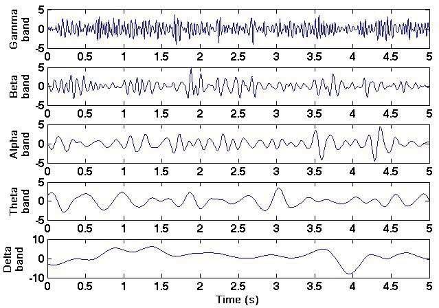
  

## **2. Objetivos**
- Adquisición de señales de EEG, utilizando el kit BiTalino: Evaluación en diferentes momentos donde el cerebro trabaja.
- Compresión del uso de softwares para la visualización de los resultados de los biopotenciales y realización de analisis de señales obtenidas.

## **3. Materiales**

|  |  |  | 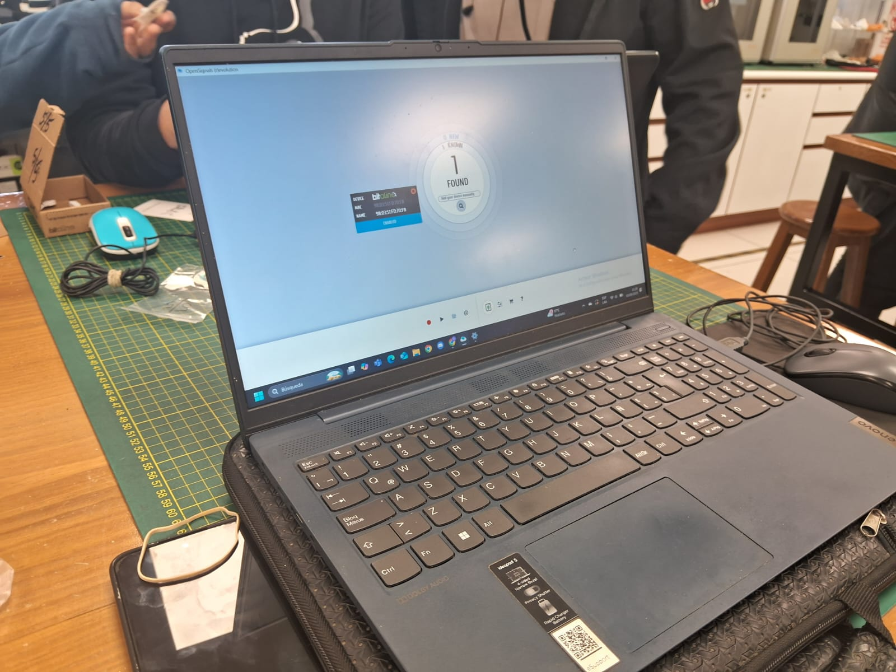 |
|----------|----------|----------|----------|
| **Un kit BITalino** | **Conector bipolar para electrodos** | **3 electrodos** | **Laptop con software Open Signals** |

## **4. Procedimiento**
Para la medición de las señales EEG en el laboratorio se realizarán diferentes lecturas cuyos momentos a evaluar en el sujeto son los siguientes:
- **Reposo** 
- **Fijar vista en un punto específico**
- **Ejercicio cognitivo de resta**
- **Acción de masticar cada 2 segundos**
- **Actividad libre (escuchar música)**

Para un mejor desarrollo y recogo de las señales EEG, se trató en mitigar lo mejor posible los estímulos externos como la luz de dia (usando un pedazo de papel o tela que disminuya la luz entrante en los párpados) y ruido externo, tanto del ambiente de laboratorio como de afuera de este (usando audífonos con jebe que puedan suprimir el ruido).

### **4.1 Conexión de electrodos**
| 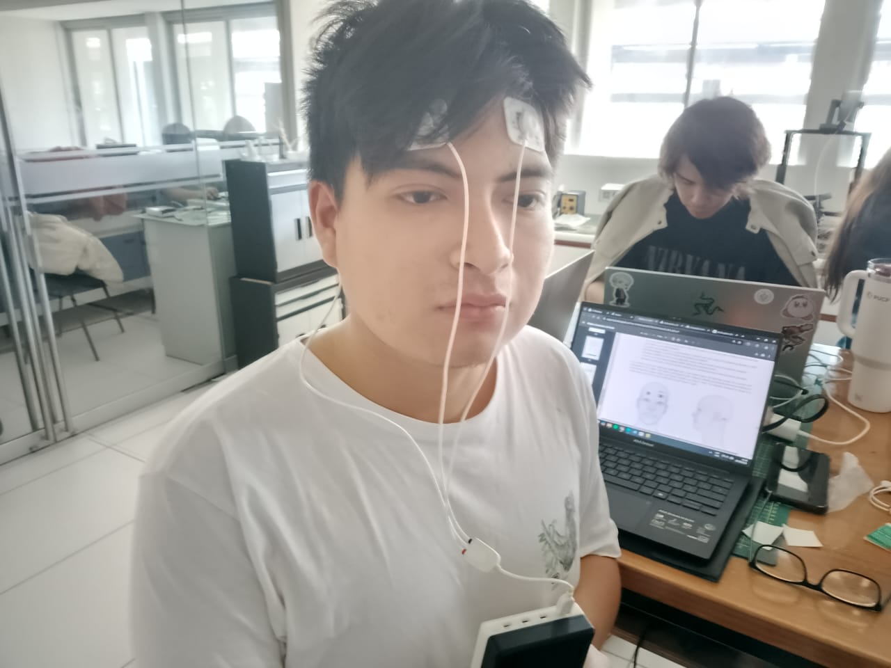 | 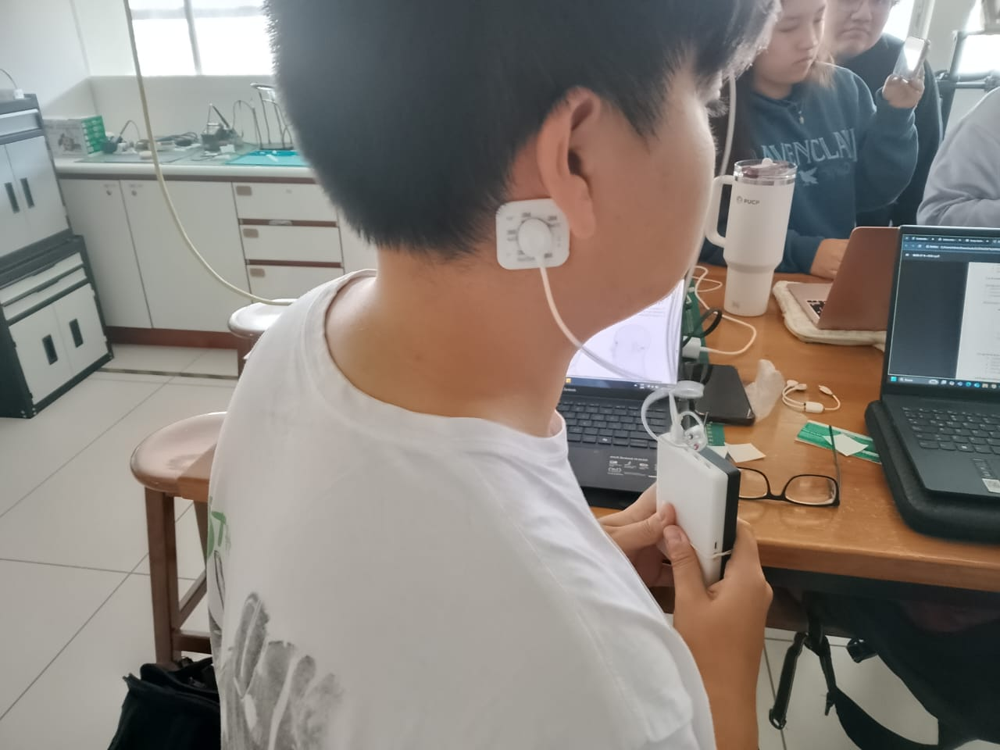 |
|----------|----------|
| **Posición Fp1 y Fp2 para comparar hemisferios frontales** | **Posición O2 para actividad visual** |

### **4.2 Pruebas**

## **5. Resultados**

  En EEG de reposo y tareas cognitivas se busca preservar las bandas canónicas (δ, θ, α, β, γ baja) y suprimir deriva lenta y EMG de alta frecuencia; por eso se aplica un pasa-banda ≈0.5–45/48 Hz, práctica empleada y recomendada en estudios actuales de análisis EEG para tareas cognitivas y reposo. Ejemplo reciente: un protocolo de atención/distraicción usa 0.5–45 Hz antes del análisis espectral y la corrección de artefactos [1D]. Además, revisiones metodológicas modernas describen este rango y el papel del preprocesado (filtrado + limpieza) como paso estándar antes de extraer potencia por bandas [2D].
  Respecto al ruido de red (50/60 Hz), puede atenuarse con un notch solo si el pico está presente; existen alternativas (p. ej., spectrum interpolation) que evitan distorsiones que el notch puede introducir. La literatura metodológica lo discute y propone procedimientos específicos para eliminar la línea con menor sesgo [3D].
  Cuando se comparan condiciones (p. ej., ojos abiertos vs. cerrados; reposo vs. tarea), la potencia relativa —potencia de banda dividida por la potencia total (p. ej., 0.5–48 Hz)— reduce la variabilidad inter-sujeto debida a impedancias y ganancias y resalta cambios proporcionales entre estados. En tareas cognitivas se usa explícitamente para mitigar las diferencias entre sujetos y mejorar la comparabilidad [4D], y su definición formal (band/total) está estandarizada en la literatura [5D].
  Aplicada al paradigma clásico ojos abiertos vs. cerrados, la potencia α relativa disminuye con ojos abiertos y aumenta con ojos cerrados, efecto documentado en estudios recientes de reposo (EO/EC) y que justifica reportar α en forma relativa para comparaciones entre condiciones/sujetos [6D].

### **5.1. Gráficas obtenidas**
### **5.1.1 Prueba 1 - Basal 1: EEG en reposo**
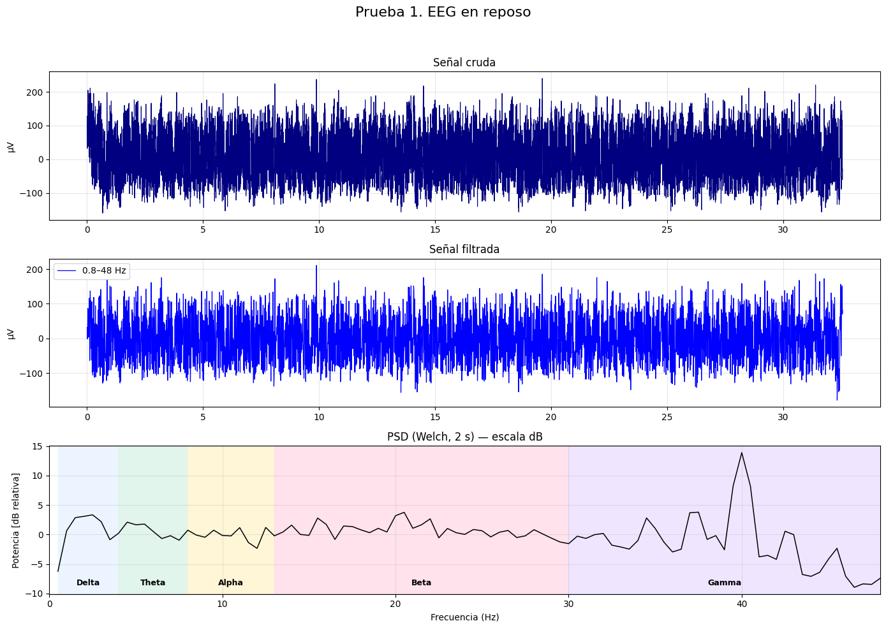

### **5.1.2 Prueba 2 - Basal 2: EEG en reposo y vista punto fijo**
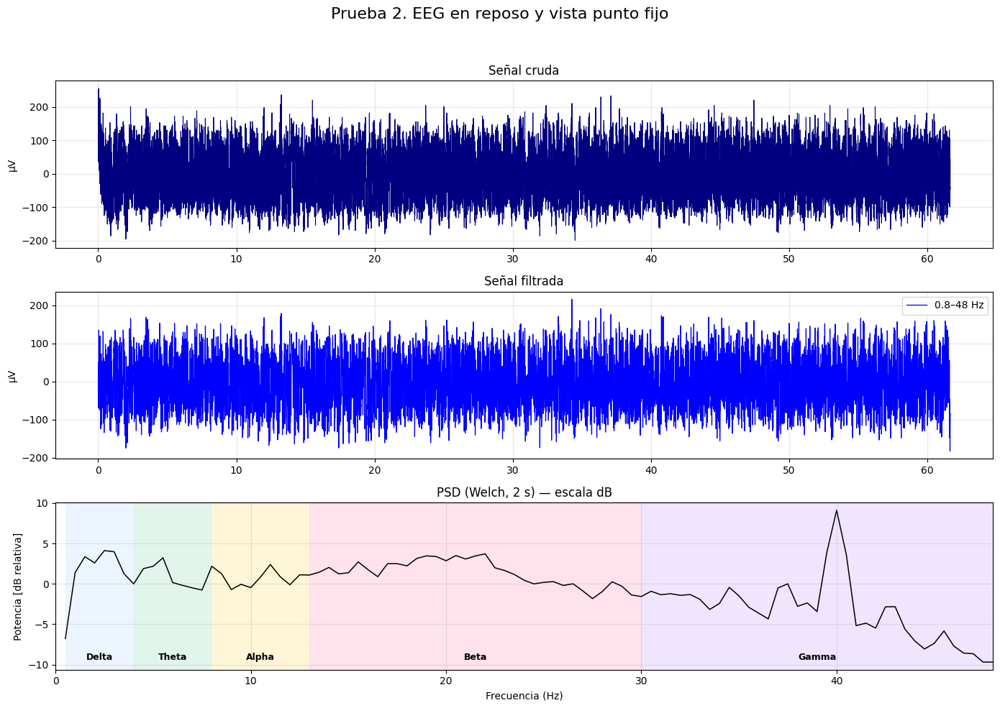

### **5.1.3 Prueba 3 - Tarea cognitiva: EEG restar 7 desde 100**
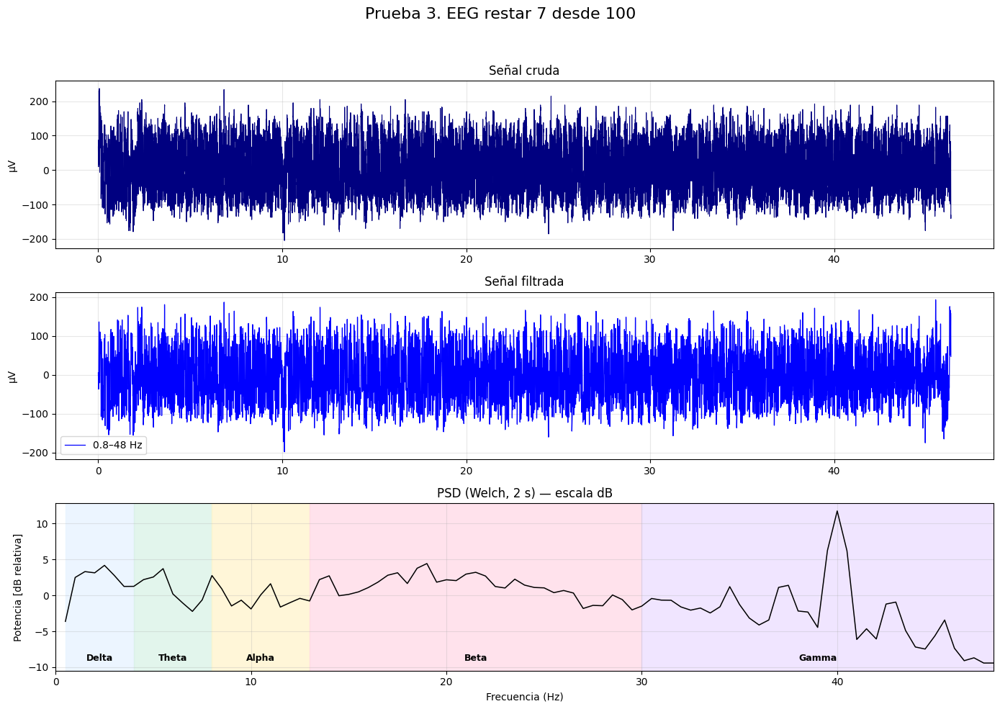

### **5.1.4 Prueba 4 - Artefactos: EEG arterfacto cada 2 segundos**
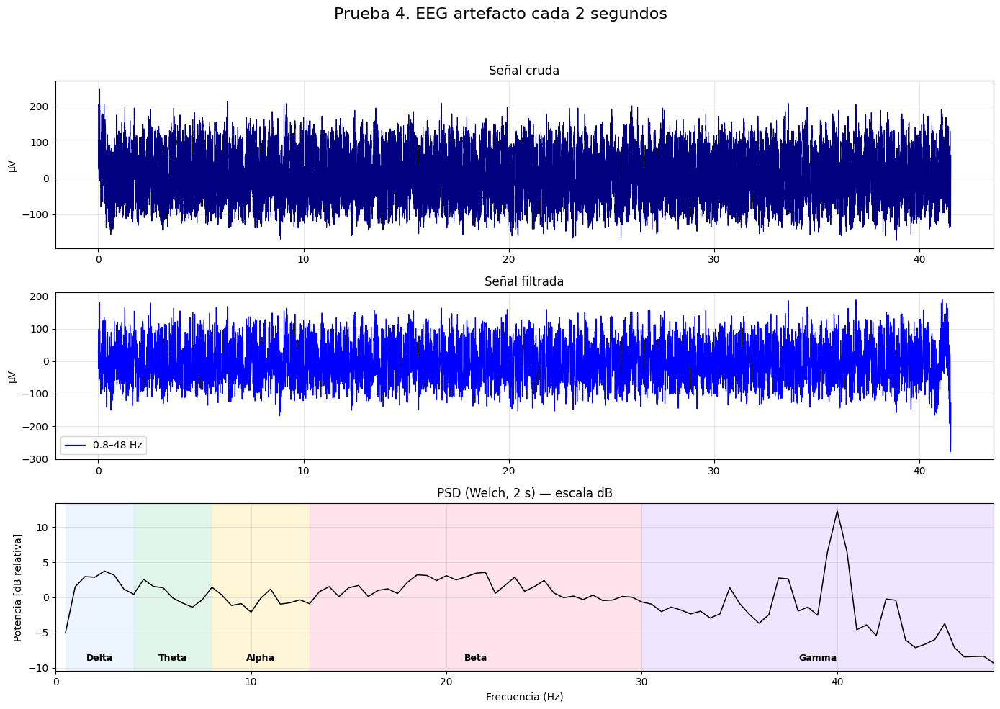

### **5.1.5 Prueba 5 - Libre: EEG escuchar música suave a potente**

### **5.2. Comparación potencia α en ojos abiertos vs. cerrados**
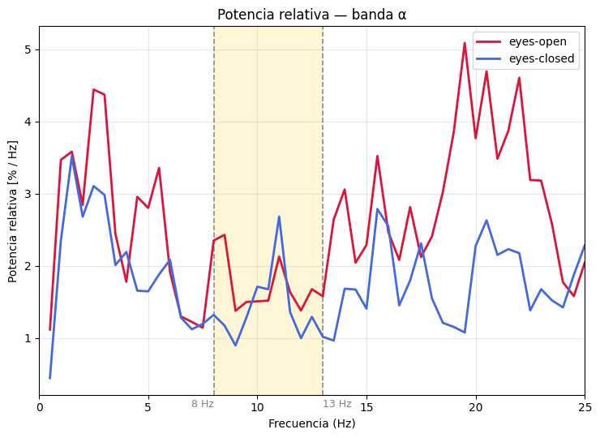

### **5.3. Comparación potencia α en ojos abiertos vs. cerrados**
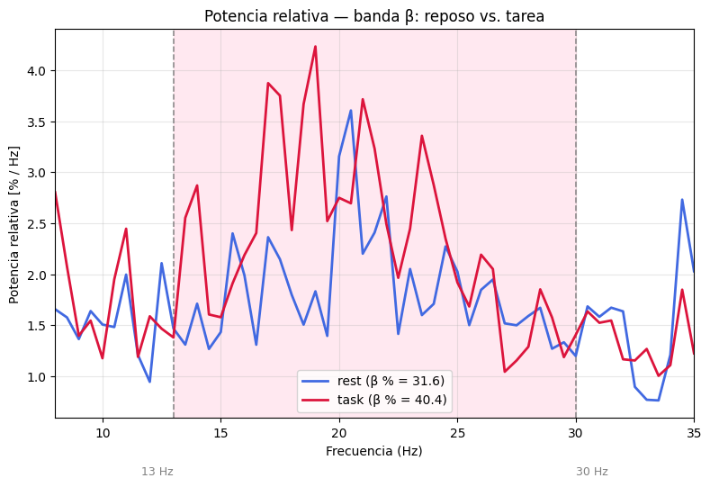

### **5.4. Comparación potencia α en ojos abiertos vs. cerrados**
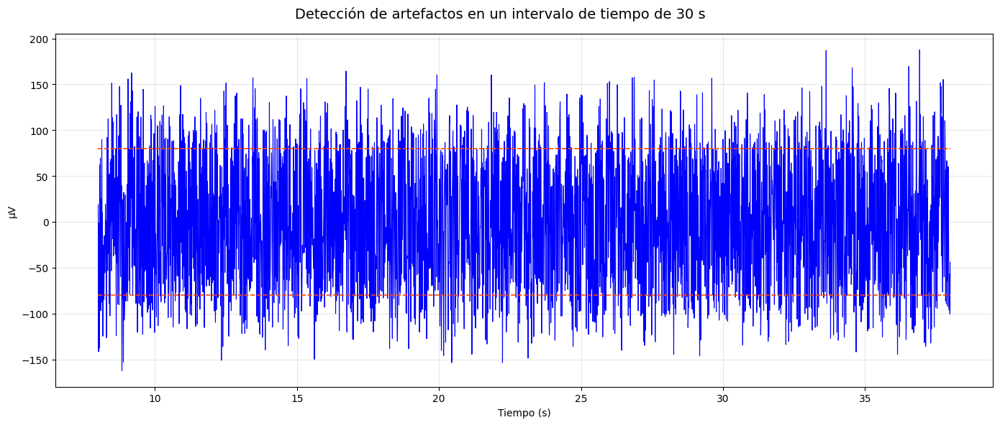
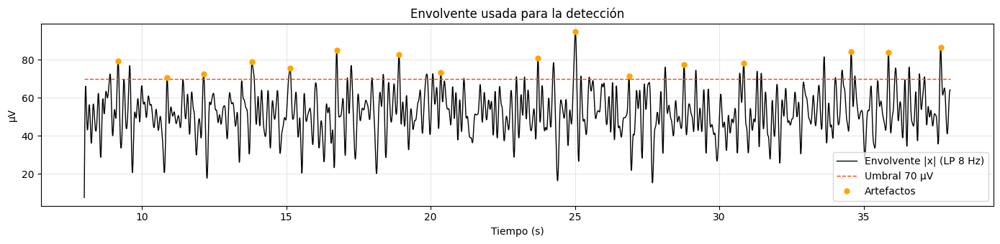

### **5.4 Interpretación de resultados**

## **6 Preguntas adicionales**
### ¿Qué banda de frecuencia predomina al cerrar los ojos?

### ¿Qué filtro es imprescindible para EEG y por qué?

### ¿Puedes modular conscientemente tu señal EEG? Da un ejemplo.

### ¿Se observan diferencias entre Fp1 y Fp2? ¿Por qué podrían ocurrir?

## **7. Referencias**
[1D] P. Kaushik et al., “Decoding the cognitive states of attention and distraction in a sustained-attention task using EEG,” Sci. Rep., 2022 — usa band-pass 0.5–45 Hz en el preprocesado. 

[2D] A. Chaddad et al., “Electroencephalography Signal Processing,” Biomedicines, 2023 — revisión metodológica: filtrado y PSD (Welch) en EEG. 

[3D] S. Leske and S. S. Dalal, “Reducing power line noise in EEG and MEG via spectrum interpolation,” NeuroImage, 2019 — alternativas al notch y cautelas sobre distorsiones. 

[4D] Q. Zhou et al., “Relative Power Correlates With the Decoding Performance of Motor Imagery-Based BCI,” Front. Hum. Neurosci., 2021 — la potencia relativa reduce variabilidad inter-sujeto en comparaciones. 

[5D] Y. Wang et al., “Relative Power of Specific EEG Bands and Their Ratios in Attention-Deficit/Hyperactivity Disorder,” Front. Hum. Neurosci., 2016 — definición y cálculo de potencia relativa (band/total).

[6D] N. M. Petro et al., “Eyes-closed versus eyes-open differences in spontaneous human brain activity,” NeuroImage, 2022 — α relativa menor en ojos abiertos que en cerrados. 