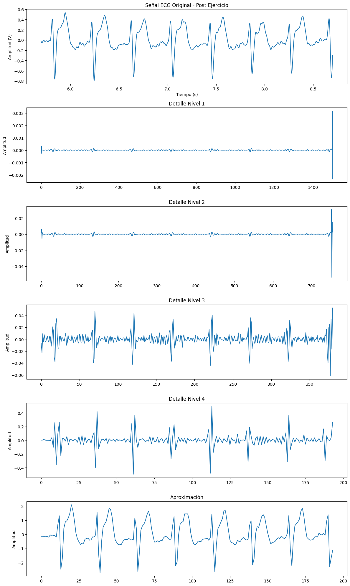
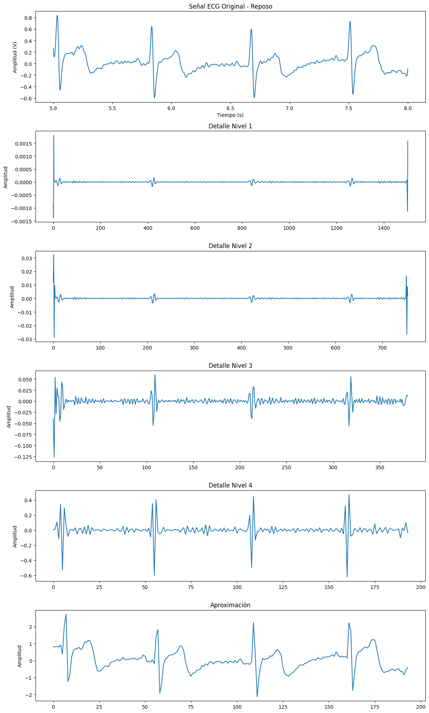
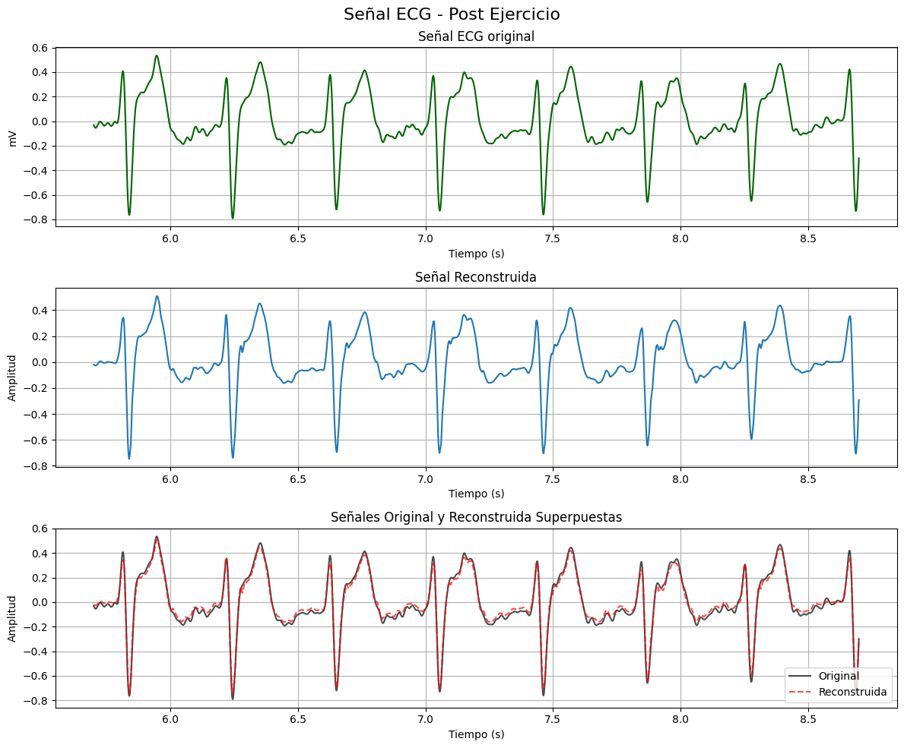
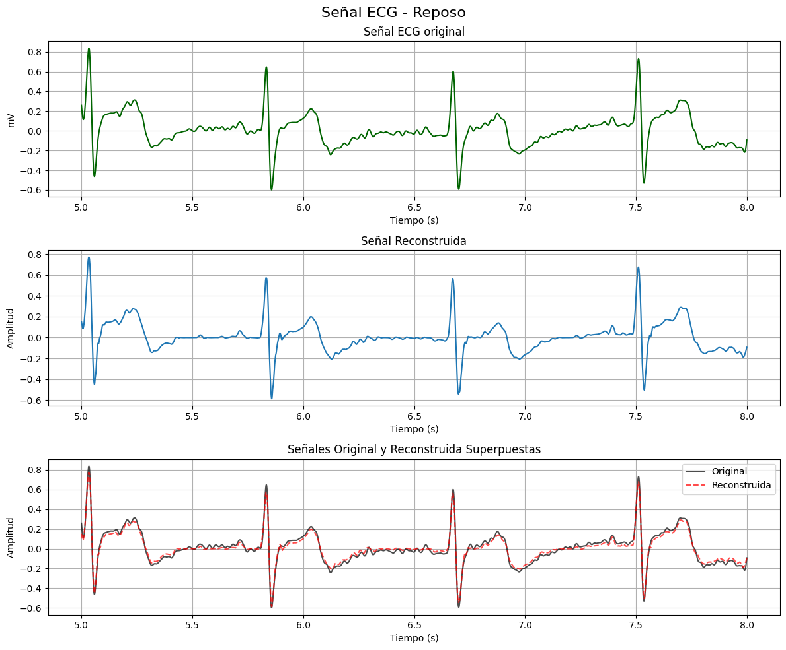

# **Reporte de laboratorio 7 - Filtrado Wavelet**

## **1. Introducción**

El electrocardiograma (ECG) es una señal biopotencial que refleja la actividad eléctrica del corazón. Debido a su baja amplitud (del orden de milivoltios), está sujeta a interferencias externas como ruido muscular, deriva de la línea base y acoplamiento de la red eléctrica (60 Hz). Estos factores pueden distorsionar las ondas P, QRS y T, complicando su interpretación clínica.

Para mitigar dichos efectos, se requiere un método de filtrado que elimine el ruido sin alterar la morfología cardíaca. En los últimos años, la Transformada Wavelet Discreta (DWT) se ha consolidado como una herramienta eficaz para este propósito, gracias a su capacidad de analizar señales no estacionarias en diferentes niveles de resolución. Esto permite separar las componentes de baja frecuencia (información fisiológica) de las de alta frecuencia (ruido) de forma adaptativa [1] [2].

En este estudio se emplea la wavelet Daubechies 4 (db4) para el filtrado y reconstrucción de señales ECG** registradas con el BITalino (Fs = 1000 Hz). La selección de esta familia se fundamenta en su similitud morfológica con el complejo QRS y su capacidad comprobada para preservar la forma de onda cardíaca mientras atenúa ruido, según estudios recientes [1]–[5].

## **2. Objetivos**

### **2.1 Objetivo general:**
Aplicar la Transformada Wavelet Discreta (DWT) para el filtrado de señales biomédicas (ECG, EMG y EEG), evaluando su capacidad para eliminar ruido y preservar la morfología fisiológica característica de cada tipo de señal.

### **2.2 Objetivos específicos:**
- Implementar el filtrado DWT con la wavelet db4 en señales ECG.
- Definir los parámetros de descomposición y umbralización más adecuados según el contenido espectral de cada señal.
- Evaluar la efectividad del filtrado mediante la comparación entre la señal original y la reconstruida.
- Analizar y discutir la calidad del filtrado en función de la morfología conservada y la reducción de ruido.

## **3. Procedimiento: Diseño del filtro**

### **3.1 Filtrado Wavelet ECG**

### **3.1.1 Selección de la familia wavelet**

Se seleccionó la Daubechies 4 (db4) como wavelet madre por ser una de las más utilizadas en el procesamiento de señales ECG. Su forma asimétrica y su soporte compacto permiten una excelente localización temporal, lo cual es esencial para capturar los picos del complejo QRS sin distorsionar las ondas P y T.  

Artículos que respaldan la elección:
- Abdou et al. (2024) [1] compararon distintas familias de wavelet para ECG de un solo canal y concluyeron que db4 ofrece una mejor preservación morfológica frente a db6.  
- Chandra et al. (2021) [2] implementaron un filtro adaptativo de alta velocidad basado en wavelets y comprobaron que db4 proporciona una mayor estabilidad temporal en el denoising de señales biomédicas.  
- Akkaya et al. (2025) [3] destacaron que la db4 sigue siendo una de las *wavelets* más efectivas para señales no estacionarias por su equilibrio entre suavizado y resolución temporal.  
- Yusuf et al. (2020) [4] demostraron que la combinación de filtros Butterworth y wavelets Daubechies, particularmente db4, mejora significativamente la SNR en el preprocesamiento de señales ECG contaminadas con ruido.  
- Xie et al. (2025) [5] propusieron un algoritmo de umbral adaptativo basado en análisis wavelet, validando que db4 permite una reducción de ruido más efectiva que métodos convencionales de filtrado.  

En conjunto, estas referencias confirman que db4 es una opción óptima para el análisis y filtrado de señales cardíacas, tanto en condiciones de reposo como post-ejercicio.

### **3.1.2 Parámetros definidos**

| Parámetro | Valor | Justificación |
|------------|--------|---------------|
| **Familia wavelet** | Daubechies 4 (db4) | Forma similar al QRS y excelente localización temporal |
| **Tipo de transformada** | Discrete Wavelet Transform (DWT) | Ideal para señales no estacionarias como el ECG |
| **Nivel de descomposición** | 4 niveles | Cubre la banda fisiológica del ECG (0.5–40 Hz) |
| **Tipo de umbral** | Soft | Evita discontinuidades en la reconstrucción |
| **Valor de umbral** | 0.1 (experimental) | Ajuste que equilibra suavizado y preservación de picos |
| **Reconstrucción** | `pywt.waverec()` | Combina coeficientes umbralizados para recuperar la señal filtrada |

#### **Justificación del número de niveles**

Con una frecuencia de muestreo de 1000 Hz, una descomposición en cuatro niveles permite aislar las bandas relevantes:
- **D1–D2:** componentes de alta frecuencia (ruido, interferencia de línea).  
- **D3–D4:** información principal del complejo QRS.  
- **A4:** bajas frecuencias (ondas P, T y línea base).  

El nivel 4 logra un balance adecuado entre supresión de ruido y preservación de los componentes fisiológicos del ECG [4].

## **4. Resultados** 

### **4.1 Resultados - filtrado de ECG**

### **4.1.1 Filtrado - coeficientes y aproximación**

### **ECG Post ejercicio - coeficientes y aproximación**

### **ECG Reposo - coeficientes y aproximación**

### **4.1.2 Reconstrucción de las señales ECG**

### **ECG Post ejercicio - recontrucción**

### **ECG Reposo - recontrucción**

## **5. Discusión** 

## **6. Referencias**

[1] A. Abdou et al., “Enhancement of single-lead dry-electrode ECG through wavelet,” *Frontiers in Signal Processing*, vol. 3, 2024. doi:10.3389/frsip.2024.1396077.

[2] M. Chandra, S. Mishra, and D. Patnaik, “Design and analysis of improved high-speed adaptive filter for biomedical signal denoising using wavelets,” *Biomedical Signal Processing and Control*, vol. 68, p. 102774, 2021. doi:10.1016/j.bspc.2020.102221.

[3] S. Akkaya, M. Kose, and O. Bayat, “Wavelet-Based Denoising Strategies for Non-Stationary Signals,” *Electronics*, vol. 14, no. 16, p. 3190, 2025. doi:10.3390/electronics14163190.

[4] S. D. Yusuf, F. C. Maduakolam, I. Umar, and A. Z. Loko, “Analysis of Butterworth filter for electrocardiogram de-noising using Daubechies wavelets,” *SSRG International Journal of Electronics and Communication Engineering*, vol. 7, no. 4, pp. 8–13, 2020.  

[5] H. Xie, J. Jiang, Z. Zhao, and J. Peng, “Thresholding noise reduction algorithm for ECG signals based on wavelet analysis,” in *Proc. 2025 5th Int. Conf. Autom. Control, Algorithm and Intell. Bionics*, pp. 507–513, 2025. doi:10.1145/3760269.3760349.