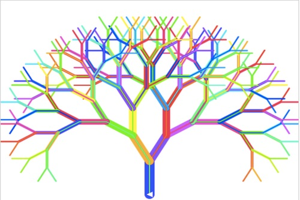
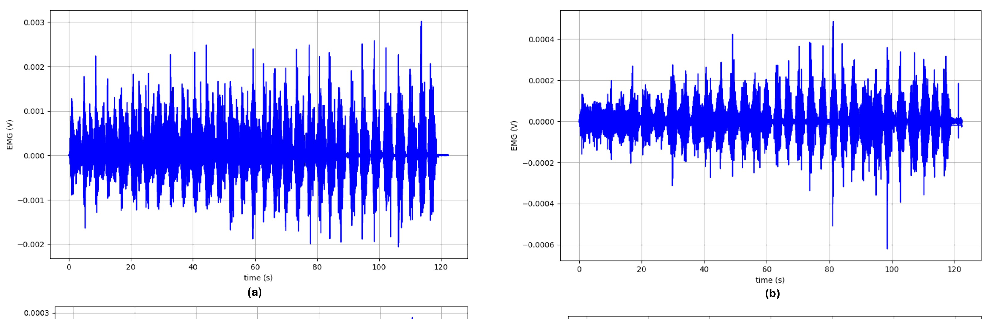
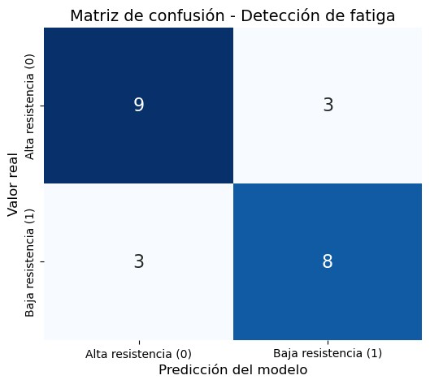

# **Clasificador de señal EMG para reconocer la correcta ejecución del ejercicio de levantar pesas en adultos**

    

## **Resumen**
Desarrollo de un sistema de monitoreo basado en señales EMG y la técnica de bosque aleatorio para clasificar la ejecución correcta o incorrecta durante ejercicios de levantamiento de pesas. Utilizando señales electromiográficas de músculos clave como el bíceps y deltoides, el sistema analiza la activación muscular y la fatiga para identificar patrones de mala técnica.

## **Palabras clave**
Machine learning, aprendizaje por computadora, random forest, árboles de decisión, fisioterapia, electromiografía.

---

## **1. Introducción**
El ejercicio de levantamiento de pesas es bastante utilizado en fisioterapia y entrenamiento funcional debido a su accesibilidad y beneficios para la salud musculoesquelética. Sin embargo, incluso con cargas bajas, el volumen repetitivo de movimientos puede inducir fatiga neuromuscular, lo cual es un indicador de una mala ejecución puesto que altera el patrón normal de activación en músculos como el bíceps y los deltoides. Además, esta alteración favorece compensaciones y desajustes técnicos que elevan el riesgo de lesiones por sobreuso, especialmente en hombros y región lumbar [1].

Estudios recientes muestran que en actividades de levantamiento de pesas, las zonas más afectadas por lesiones son la zona lumbar (23–31%) y los hombros (11–17%), lo cual deja clara la importancia de supervisar la técnica de ejecución aun cuando se tienen condiciones controladas o recreativas [1]. A pesar de ello, la evaluación tradicional de la técnica se sigue realizando de forma visual y depende del criterio humano, con lo cual se tienen limitaciones para identificar errores sutiles o patrones de fatiga temprana.

La electromiografía superficial (EMG) permite medir objetivamente la activación muscular en tiempo real, lo que permite ofrecer una alternativa precisa y no invasiva para evaluar la calidad del movimiento. La literatura demuestra que características como RMS, iEMG, MNF y MDF pueden capturar cambios relevantes asociados al esfuerzo y la fatiga muscular [2], [3].

De acuerdo a este contexto, el presente proyecto busca desarrollar un sistema de clasificación basado en machine learning para diferenciar ejecuciones correctas e incorrectas durante el levantamiento de pesas, empleando características derivadas de señales EMG.

  
  

---

## **2. Antecedentes**
Las ideas de las técnicas de machine learning (ML) existen desde 1943 e incluyen a las de deep learning, conocidas actualmente como inteligencia artificial (IA), que representan su origen conceptual [4]. Estas técnicas consisten en la generación de una lógica de procesamiento de información con mínima intervención humana, ya sea mediante métodos iterativos, estadísticos o combinados [4]. Mientras que las técnicas de ML sin redes neuronales enfatizan el uso de herramientas estadísticas y conceptos como la entropía de la información para crear algoritmos de aprendizaje automatizado, las técnicas de deep learning se basan en redes neuronales, lo que simplifica aún más el proceso al reducir la necesidad de diseñar explícitamente los algoritmos [4].

Las técnicas de deep learning, al utilizar redes neuronales capaces de realizar grandes cantidades de permutaciones y ajustes en la comunicación entre nodos, poseen la propiedad de ser altamente generalizables y han demostrado gran potencial para detectar patrones complejos en datos no estructurados [4]. Sin embargo, presentan limitaciones importantes frente al ML clásico: requieren recursos computacionales elevados, la lógica interna de procesamiento es prácticamente opaca para el programador y son más sensibles al overfitting y al sesgo, con menor capacidad para corregirlo sin aumentar o modificar los datos de entrenamiento, incrementar los recursos o restringir las capacidades de aprendizaje [4].

Debido a las altas exigencias computacionales del deep learning, su implementación suele depender de computadoras potentes o servicios en la nube, lo cual limita su uso para detección en tiempo real debido a la latencia, el costo y la necesidad de conectividad. Por ello, las técnicas de ML clásico resultan más adecuadas para sistemas ligeros y de baja latencia, especialmente cuando se trabaja con datos estructurados [5].

La técnica de Random Forest, o bosques aleatorios, se basa en la generación de un conjunto o ensemble de árboles de decisión, los cuales se construyen utilizando algoritmos que se apoyan en el concepto de entropía de la información [6]. Los árboles buscan realizar particiones sucesivas de los datos de entrenamiento, reduciendo la entropía en cada división [6]. Cuando una partición logra separar adecuadamente un grupo, se detiene la ramificación en esa dirección, continuando solo en las ramas necesarias.

Cada nodo del árbol representa una probabilidad de pertenencia a una clase, por lo que los árboles requieren cierto grado de aleatorización en sus decisiones. Una ventaja importante es que la lógica de un árbol de decisión es observable y manipulable por el programador, permitiendo evaluar la relevancia de cada partición, detectar datos atípicos y realizar poda para eliminar ramas poco significativas o propensas a overfitting [6].

Una vez generado el conjunto de árboles, cada uno entrenado con un subconjunto diferente de los datos que les confiere una perspectiva ligeramente distinta, Random Forest toma como resultado final la clasificación más frecuente entre todos ellos. Este proceso equivale a promediar decisiones, lo cual aumenta la capacidad de generalización del modelo y su resistencia al overfitting y al ruido [6].

---

## **3. Planteamiento del problema**
A pesar de la alta prevalencia de lesiones relacionadas con ejercicios de fuerza, no existen herramientas accesibles que permitan monitorear de forma automática y en tiempo real la correcta ejecución del levantamiento de pesas. La supervisión humana puede ser subjetiva, inconsistente y difícil de mantener en sesiones no supervisadas, sobre todo en poblaciones vulnerables. Esto genera la necesidad de un sistema objetivo que evalúe la técnica a partir de biomarcadores musculares medidos mediante EMG.

---

## **4. Propuesta de solución**
Se propone un sistema basado en señales EMG y un modelo de clasificación tipo Random Forest que pueda ser capaz de distinguir entre ejecuciones correctas e incorrectas durante el levantamiento de pesas. El sistema utiliza las señales EMG de bíceps y deltoides, a partir de las cuales se extraen características temporales y espectrales. Estas características se incorporan a un modelo de machine learning entrenado para identificar patrones que estén asociados a fatiga o pérdida de control, indicadores que ayudan a identificar una incorrecta ejecución del ejercicio para posteriormente generar alertas en tiempo real.

  
  

---

## **5. Materiales y Métodos**

### **5.1 Base de datos utilizada**

    

Se empleó el dataset público **A Comprehensive Dataset of Surface Electromyography and Self-Perceived Fatigue Levels for Muscle Fatigue Analysis**, que contiene señales EMG de 13 participantes realizando distintos movimientos de flexión con pesos ligeros [2].  
Se registraron señales de bíceps braquial (derecho e izquierdo) y de las tres porciones del deltoides.

### **5.2 Preprocesamiento de señales EMG**
Los archivos fueron organizados por sujeto, músculo y ensayo. Posteriormente, se realizó:

- Segmentación del tramo activo de la señal.  
- Selección del canal correspondiente a cada músculo.  
- Normalización por %MVC (Maximum Voluntary Contraction), para hacer comparables señales entre sujetos y reducir variabilidad por fuerza individual o diferencias anatómicas.

### **5.3 Extracción de características**
Se calcularon:

- RMS (Root Mean Square): indica la activación promedio; se obtiene como la raíz del promedio de los cuadrados de la señal.  
- iEMG (integrated EMG): mide el esfuerzo total de la contracción; corresponde a la integral de la señal rectificada.  
- MNF (Mean Frequency): centro de gravedad espectral; disminuye con fatiga.  
- MDF (Median Frequency): frecuencia que divide la potencia espectral en dos mitades; también disminuye bajo fatiga [3].  
- Tiempos hasta los niveles de fatiga reportados en el dataset (Fatigue Level 1 y 2).

Todos estos parámetros se consolidaron en una matriz de datos lista para clasificación.

### **5.4 Entrenamiento del modelo**
- División entrenamiento/prueba: 70/30.  
- Etiquetado: basado en la media del tiempo de fatiga (alta vs. baja resistencia).  
- Modelo utilizado: Random Forest Classifier por su robustez, baja latencia y resistencia al overfitting.  
- Se evaluó la precisión, matriz de confusión y errores de clasificación.

---

## **6. Resultados**

De observación de los datos:

- La disminución en MNF y MDF indica fatiga.  
- Valores muy elevados de RMS indican descontrol.  
- Valores fuera de rango (40–90 %) en la señal relativa a MVC indican carga desequilibrada.

Del entrenamiento:

    

- Precisión de 73.91 %.  
- Margen de error de 6 muestras.

La matriz de confusión obtenida muestra que el modelo logró clasificar correctamente 9 de los 12 casos de alta resistencia y 8 de los 11 casos de baja resistencia, lo que deja un desempeño equilibrado entre ambas clases. Los errores se distribuyen de forma igualitaria en ambos casos (3 falsos positivos y 3 falsos negativos), lo cual indica que el modelo no presenta un sesgo marcado hacia ninguna categoría. Este comportamiento es consistente con un clasificador que captura adecuadamente los patrones fisiológicos asociados a la fatiga muscular, a pesar de que aún tiene dificultad para distinguir ciertos casos limítrofes en los que las características extraídas (RMS, iEMG, MNF y MDF) muestran valores que son intermedios o se superponen entre clases. En conjunto, estos resultados sugieren que el sistema posee una capacidad razonable para diferenciar entre ejecuciones con alta y baja resistencia muscular, lo que permite darse cuenta de la utilidad del enfoque basado en EMG y Random Forest.

Los resultados obtenidos indican que las características EMG elegidas son efectivas para capturar patrones de activación y fatiga relevantes para evaluar la técnica en ejercicios de fuerza. La disminución sistemática de MNF y MDF coincide con estudios previos sobre fatiga muscular [3], mientras que las variaciones anómalas en RMS reflejan momentos de descontrol o compensación, coherentes con lo descrito en [7].

El modelo Random Forest demostró ser capaz de diferenciar ejecuciones correctas e incorrectas con un desempeño aceptable para una primera aproximación. Sin embargo, el rendimiento puede mejorar incorporando señales de mayor resolución, calibraciones individuales del MVC y técnicas de extracción de características más avanzadas.

---

## **7. Conclusiones**
- Se logró desarrollar un sistema capaz de clasificar ejecuciones correctas e incorrectas durante el levantamiento de pesas utilizando características extraídas de señales EMG.  
- La metodología implementada permite monitorear la fatiga muscular y la técnica en tiempo real.  
- Este sistema tiene potencial para aplicaciones en entrenamiento personalizado, rehabilitación y prevención de lesiones en adultos.  
- La precisión alcanzada demuestra la viabilidad del enfoque, aunque existe margen para optimizar el modelo y ampliar la base de datos.

---

## **8. Limitaciones**
- El dataset proviene de ensayos controlados, por lo cual el modelo debe validarse en usuarios reales con variaciones de técnica.  
- Las señales EMG pueden verse afectadas por sudor, desplazamiento de electrodos y ruido por movimiento.  
- Se recomienda ampliar la cantidad de sujetos, incluir protocolos estandarizados de MVC y explorar modelos adicionales como SVM o redes neuronales ligeras.

---

## **9. Referencias**
[1] M. J. Y. Tung, G. A. Lantz, A. D. Lopes, and L. Berglund, “Injuries in weightlifting and powerlifting: an updated systematic review,” BMJ Open Sport & Exercise Medicine, vol. 10, no. 4, 2024, doi: 10.1136/bmjsem-2023-001884.

[2] S. M. Cerqueira, R. Vilas Boas, J. Figueiredo, and C. P. Santos, “A comprehensive dataset of surface electromyography and self-perceived fatigue levels for muscle fatigue analysis,” Sensors, vol. 24, no. 24, p. 8081, 2024, doi: 10.3390/s24248081.

[3] J. Sun et al., “Application of Surface Electromyography in Exercise Fatigue,” Frontiers in Systems Neuroscience, 2022, doi: 10.3389/fnsys.2022.893275.

[4] O. S. Ekundayo and A. E. Ezugwu, “Deep learning: Historical overview from inception to actualization, models, applications and future trends,” Applied Soft Computing, p. 113378, 2025, doi: 10.1016/j.asoc.2025.113378.

[5] V. Sheth, U. Tripathi, and A. Sharma, “A comparative analysis of machine learning algorithms for classification purpose,” Procedia Computer Science, vol. 215, pp. 422–431, 2022, doi: 10.1016/j.procs.2022.12.044.

[6] L. Breiman and A. Cutler, “RFtools – for predicting and understanding data,” in Interface Workshop, 2004, pp. 1–62.

[7] H. M. Qassim et al., “Proposed Fatigue Index for the Objective Detection of Muscle Fatigue Using Surface Electromyography,” Sensors, vol. 22, no. 5, p. 1900, 2022, doi: 10.3390/s22051900.

---

## **10. Biografías de autores**
Andrés Nicolás Landeo Cruzado – Estudiante de Ingeniería Biomédica, con interés en Ingeniería Clínica, Biomecánica y procesamiento de señales e imágenes biomédicas. Busca aplicar estas técnicas en entornos clínicos y profesionales.  
Correo: andres.landeo@upch.pe

Nicolás Alejandro Vásquez Carrillo – Estudiante de Ingeniería Biomédica, interesado en áreas vinculadas al análisis de señales biomédicas y su aplicación en la atención al paciente. Motivado por comprender la complejidad de los sistemas fisiológicos y su impacto en la salud.  
Correo: nicolas.vasquez@upch.pe

Luis Fernando Galván Núñez – Estudiante de Ingeniería Biomédica, con interés en procesos de diseño, modelamiento fisiológico y tecnologías biomédicas. Enfocado en integrar conceptos teóricos con aplicaciones prácticas en ingeniería clínica.  
Correo: luis.galvan@upch.pe

Diego Fabrizio Munayco Saravia – Estudiante de Ingeniería Biomédica, con interés en biomecánica, ingeniería clínica y procesamiento de señales para aplicaciones en salud. Posee experiencia en modelado 3D y busca ampliar su dominio en análisis de señales fisiológicas.  
Correo: diego.munayco@upch.pe
