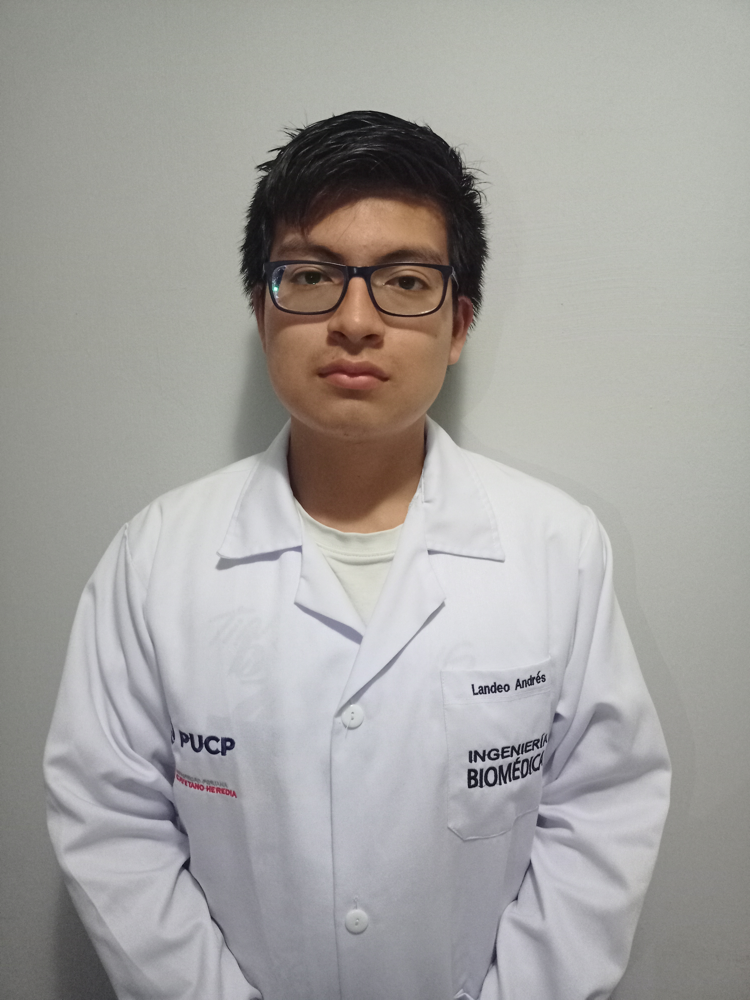

# <ins>Introducción a Señales Biomédicas</ins>

## <ins>Grupo 09 / Ciclo 2025-II📚</ins>

## ¿Quienes somos?
Somos estudiantes de la carrera de Ingeniería Biomédica PUCP-UPCH desarrollando el curso de Introducción a Señales Biomédicas 

| Andrés Nicolas Landeo Cruzado  | Nicolás Alejandro Vásquez Carrillo | Luis Fernando Galván Nuñez | 
|-------|----------|----------|  
| 📧 andres.landeo@upch.pe | 📧 nicolas.vasquez@upch.pe | 📧  |  
| | [Foto] | [Foto] |
| Descripción | Descripción | Descripción | 

## Docentes del curso 🧑‍🏫
- Moisés Stevend Meza Rodriguez
- José Alonso Caceres Del Aguila
