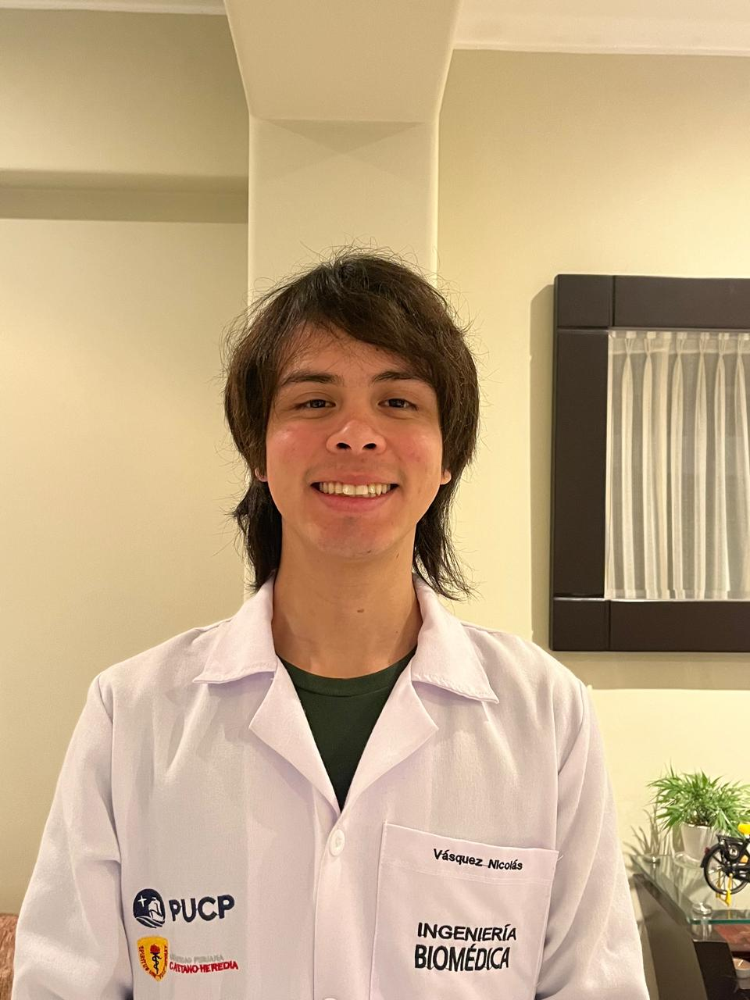
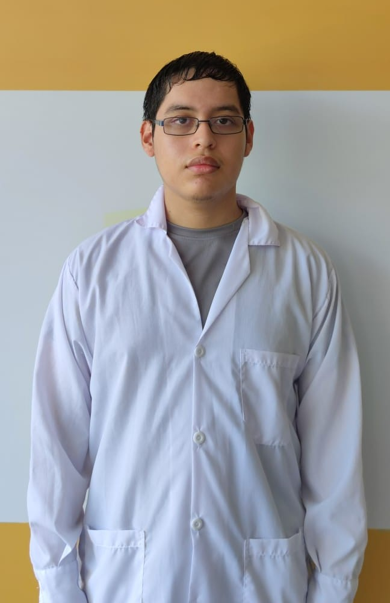

<h1 align="center"><ins>Grupo 09 / Ciclo 2025-II </ins></h1>

  

¡Sean bienvenidos a nuestro repositorio!😁🙌 En este espacio como grupo nos encargaremos de brindarles toda la información con respecto al curso como actividades de laboratorio y avances de proyecto realizados en el curso durante el ciclo vigente.

## <ins>Introducción a Señales Biomédicas📚</ins> 

El curso de Introducción a Señales Biomédicas tiene como propósito desarrollar los conocimientos necesarios para el tratamiento de señales provenientes de dispositivos médicos. Asimismo se abordan el estudio de los sensores, la tecnología de adquisición, los procesos clínicos en los que se dan y protocolos que se usan para compartir la información entre los diferentes equipos que brindan señales; usando el lenguaje de programación más conocido, Python, y kits de desarrollo para la adquisición de bioseñales.

### ¿Quienes somos?
Somos estudiantes de la carrera de Ingeniería Biomédica PUCP-UPCH desarrollando el curso de Introducción a Señales Biomédicas.

| Andrés Nicolas Landeo Cruzado  | Nicolás Alejandro Vásquez Carrillo | Luis Fernando Galván Nuñez | 
|-------|----------|----------|  
| 📧 andres.landeo@upch.pe | 📧 nicolas.vasquez@upch.pe | 📧 luis.galvan@upch.pe |  
|  | /|  |
| Me presento como estudiante de 7mo ciclo cuyas áreas de interés son la Ingeniería Clínica, Biomecánica y la concentración de Señales e Imágenes. En el curso tengo las expectativas en aprender las distintas técnicas para identificar y manejar señales de todo tipo, además de tener la experiencia de aplicarlas en la vida laboral. | Me presento. Soy Nicolás, estudiante de 8vo ciclo de la carrera, tengo interés en varias areas de la carrera pero mi interesa mucho más el poder brindar un servicio, a través del área donde me enfoque, correcto al paciente. Tengo mucha expectativa por aprender señales biomédicas por la importancia dentro del campo de la salud como lo complejas y llamativas que pueden llegar a ser.  | Soy un estudiante de 7mo ciclo, y con interés general en ingeniería biomédica. Tengo la expectativa de poder familiarizarme más con los procesos de diseño, aprender sobre las tecnologías actuales y pasadas, conocer distintos modelos del funcionamiento del organismo, e integrar los aprendizajes de ciclos pasados. | 

### Docentes del curso 🧑‍🏫
En agradecimiento a los docentes que nos acompañan este ciclo: 
- Moisés Stevend Meza Rodriguez
- José Alonso Caceres Del Aguila
- William's Ernesto Limonchi Sandoval
- Umbert Lewis De la Cruz Rodriguez

